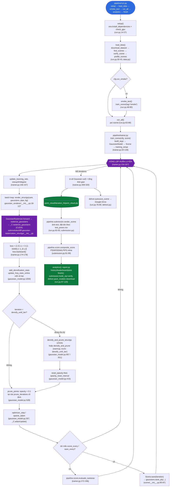

# 🗺️ Roadmap công thức toán học — SADGS

Bản đồ đọc **từ công thức nào đến công thức nào**, theo đúng thứ tự luồng xử lý thật của
pipeline SADGS (3D Gaussian Splatting). Mỗi dòng là một công thức/khối trong `MATH/`,
bấm vào link là nhảy thẳng tới đúng mục đó trong file (không phải chỉ mở file).

> 📌 **Cách dùng**: mở file này bằng trình xem Markdown hỗ trợ anchor (VS Code preview, GitHub, ...).
> Link dạng `file.md#anchor` sẽ cuộn thẳng tới đúng heading. Nếu trình xem của bạn không hỗ trợ anchor,
> link vẫn mở đúng file — chỉ cần tự tìm theo tiêu đề in đậm ngay sau link.

---

## Mục lục chương

- [1. Tham số & tiền xử lý dữ liệu](#chuong-1)
- [2. Entry point huấn luyện & pipeline điều phối](#chuong-2)
- [3. Scene, Camera & dữ liệu Gaussian](#chuong-3)
- [4. Renderer phía Python](#chuong-4)
- [5. CUDA Rasterizer — bản đã kiểm chứng kỹ nhất (khuyến nghị đọc)](#chuong-5)
- [6. CUDA Rasterizer — bản mirror theo cấu trúc cũ](#chuong-6)
- [7. Submodule phụ trợ: Fused-SSIM & Simple-KNN](#chuong-7)
- [8. Utils — các khối công thức dùng chung](#chuong-8)
- [9. LPIPS (perceptual loss)](#chuong-9)
- [10. Render & đánh giá kết quả](#chuong-10)
- [11. Toàn cảnh một trang (end-to-end)](#chuong-11)

---

<a id="chuong-1"></a>
## 1. Tham số & tiền xử lý dữ liệu

*Đọc trước tiên: định nghĩa tham số huấn luyện, và script chuyển COLMAP/tạo dữ liệu.*

### 📄 [`argument/__init__.md`](argument/__init__.md)
<sub>`arguments/__init__.py` không chứa phép tính toán học nào trực tiếp (ngoài `extract()` xử lý Namespace và `get_combined_args` merge config). Giá trị của file nằm ở việc **định nghĩa các siêu tham số (hyperparameter)**...</sub>

- [Nhận định chung](argument/__init__.md#nhận-định-chung)
- [0. Trích dẫn nguyên văn ba nhóm tham số (nguồn của mọi hằng số dùng bên dưới)](argument/__init__.md#0-trích-dẫn-nguyên-văn-ba-nhóm-tham-số-nguồn-của-mọi-hằng-số-dùng-bên-dưới)
    - [`ModelParams` (`arguments/__init__.py`, dòng 47–62)](argument/__init__.md#modelparams-arguments__init__py-dòng-4762)
    - [`PipelineParams` (dòng 64–71)](argument/__init__.md#pipelineparams-dòng-6471)
    - [`OptimizationParams` (dòng 73–160)](argument/__init__.md#optimizationparams-dòng-73160)
- [1. `ModelParams` — tham số mô hình/scene](argument/__init__.md#1-modelparams-tham-số-mô-hìnhscene)
- [2. `PipelineParams` — tham số pipeline render](argument/__init__.md#2-pipelineparams-tham-số-pipeline-render)
- [3. `OptimizationParams` — siêu tham số huấn luyện/densify](argument/__init__.md#3-optimizationparams-siêu-tham-số-huấn-luyệndensify)
    - [3.1. Learning rate (lịch mũ `get_expon_lr_func`, `gaussian_model.md` §4)](argument/__init__.md#31-learning-rate-lịch-mũ-get_expon_lr_func-gaussian_modelmd-§4)
    - [3.2. Hàm mất mát (`train.md` §1)](argument/__init__.md#32-hàm-mất-mát-trainmd-§1)
    - [3.3. Densification chuẩn (`gaussian_model.md` §5)](argument/__init__.md#33-densification-chuẩn-gaussian_modelmd-§5)
    - [3.4. Tham số dành riêng StructGS / FastGS (`gaussian_model.md` §6)](argument/__init__.md#34-tham-số-dành-riêng-structgs-fastgs-gaussian_modelmd-§6)
    - [3.5. Tham số lấy mẫu tần số / structure tensor](argument/__init__.md#35-tham-số-lấy-mẫu-tần-số-structure-tensor)
    - [3.6. Prune](argument/__init__.md#36-prune)
    - [3.7. Khởi tạo / lấy mẫu bổ sung](argument/__init__.md#37-khởi-tạo-lấy-mẫu-bổ-sung)
- [Bảng hằng số/ngưỡng (giá trị mặc định)](argument/__init__.md#bảng-hằng-sốngưỡng-giá-trị-mặc-định)
- [Bảng tương ứng cú pháp ↔ công thức](argument/__init__.md#bảng-tương-ứng-cú-pháp-↔-công-thức)

### 📄 [`convert.md`](convert.md)
<sub>`convert.py` là một wrapper shell gọi các lệnh **COLMAP** (`feature_extractor`, `exhaustive_matcher`, `mapper`, `image_undistorter`) và **ImageMagick** (`mogrify -resize`) qua `os.system(...)`. File **không tự cài đặt...</sub>

- [Nhận định chung](convert.md#nhận-định-chung)
- [1. Tỉ lệ thu nhỏ ảnh (`--resize`)](convert.md#1-tỉ-lệ-thu-nhỏ-ảnh---resize)
- [2. Tham số dung sai Bundle Adjustment (truyền cho COLMAP, không tính trong Python)](convert.md#2-tham-số-dung-sai-bundle-adjustment-truyền-cho-colmap-không-tính-trong-python)
- [3. Cờ GPU nhị phân](convert.md#3-cờ-gpu-nhị-phân)
- [Bảng hằng số/ngưỡng](convert.md#bảng-hằng-sốngưỡng)
- [Bảng tương ứng cú pháp ↔ công thức](convert.md#bảng-tương-ứng-cú-pháp-↔-công-thức)

---

<a id="chuong-2"></a>
## 2. Entry point huấn luyện & pipeline điều phối

*`train.py` từng là vòng lặp huấn luyện CLI độc lập; `pipeline/*` là lớp điều phối bọc xung quanh (chạy thực nghiệm,
báo cáo, nộp bài) — hiện là **nhánh huấn luyện duy nhất còn dùng** (chạy trên Google Colab). Xem [§11](#chuong-11).*

> ⚠️ **`train.py` đã bị xoá khỏi repo** (dự án chỉ chạy trên Colab qua `pipeline/trainer.py`, xem [§11](#chuong-11)).
> `train.md` dưới đây vẫn giữ lại làm tài liệu công thức tham khảo (file `.py` nguồn có thể khôi phục qua git nếu cần).

### 📄 [`train.md`](train.md)
<sub>Tài liệu tổng hợp cơ sở toán học trong vòng lặp huấn luyện `training()`, bám sát đúng thứ tự và hệ số xuất hiện trong code.</sub>

- [1. Hàm mất mát tổng (RGB loss)](train.md#1-hàm-mất-mát-tổng-rgb-loss)
- [2. EMA (Exponential Moving Average) cho loss hiển thị](train.md#2-ema-exponential-moving-average-cho-loss-hiển-thị)
- [3. Gradient trung bình dùng cho densify](train.md#3-gradient-trung-bình-dùng-cho-densify)
- [4. Tiêu chí đa-góc-nhìn (Multiview Consistency) cho split/prune](train.md#4-tiêu-chí-đa-góc-nhìn-multiview-consistency-cho-splitprune)
- [5. Lịch trình / ngưỡng vòng lặp huấn luyện](train.md#5-lịch-trình-ngưỡng-vòng-lặp-huấn-luyện)
- [6. Chuẩn hoá thời gian và bộ nhớ (không phải công thức mô hình, chỉ là phép tính đo đạc)](train.md#6-chuẩn-hoá-thời-gian-và-bộ-nhớ-không-phải-công-thức-mô-hình-chỉ-là-phép-tính-đo-đạc)
- [7. Đánh giá định kỳ (`training_report`)](train.md#7-đánh-giá-định-kỳ-training_report)
- [8. Bảng hằng số/ngưỡng xuất hiện trong `train.py`](train.md#8-bảng-hằng-sốngưỡng-xuất-hiện-trong-trainpy)
- [Bảng tương ứng cú pháp ↔ công thức](train.md#bảng-tương-ứng-cú-pháp-↔-công-thức)

### 📄 [`pipeline/__init__.md`](pipeline/__init__.md)
<sub>**Nhận xét:** File này chỉ là lớp re-export (gom `Config` và các hàm của `pipeline.env` thành API công khai của package `pipeline`). Không có công thức toán học nào — đây thuần tuý là định tuyến import. Toàn văn file ...</sub>

- [Bảng tương ứng cú pháp ↔ công thức](pipeline/__init__.md#bảng-tương-ứng-cú-pháp-↔-công-thức)

### 📄 [`pipeline/config.md`](pipeline/config.md)
<sub>**Nhận xét:** Đây là file cấu hình (`dataclass Config`) cho pipeline huấn luyện trên Colab. Phần lớn là tham số mặc định (đường dẫn, cờ bật/tắt); công thức toán học chỉ xuất hiện ở chỗ các tham số huấn luyện 3DGS được...</sub>

- [1. Co giãn mốc dừng densify theo số vòng huấn luyện](pipeline/config.md#1-co-giãn-mốc-dừng-densify-theo-số-vòng-huấn-luyện)
    - [Tại sao không giữ nguyên mốc gốc?](pipeline/config.md#tại-sao-không-giữ-nguyên-mốc-gốc)
- [2. Co giãn chu kỳ reset opacity theo số vòng huấn luyện](pipeline/config.md#2-co-giãn-chu-kỳ-reset-opacity-theo-số-vòng-huấn-luyện)
    - [Lý do thay đổi (ghi trong comment của code)](pipeline/config.md#lý-do-thay-đổi-ghi-trong-comment-của-code)
- [3. Lấy mẫu con hold-out (gián tiếp, dùng ở nơi khác qua `llffhold`)](pipeline/config.md#3-lấy-mẫu-con-hold-out-gián-tiếp-dùng-ở-nơi-khác-qua-llffhold)
- [4. Các hàm tiện ích đường dẫn (không mang ý nghĩa toán học)](pipeline/config.md#4-các-hàm-tiện-ích-đường-dẫn-không-mang-ý-nghĩa-toán-học)
- [Bảng tương ứng cú pháp ↔ công thức](pipeline/config.md#bảng-tương-ứng-cú-pháp-↔-công-thức)

### 📄 [`pipeline/trainer.md`](pipeline/trainer.md)
<sub>File này bọc quanh `train.py` gốc của repo. Phần dưới đây **chỉ** trích các công thức/ngưỡng **riêng của `trainer.py`** (co giãn lịch theo `cfg.iterations`, EMA loss, tỉ lệ split/prune theo tần số) — loss cơ bản ($L1$...</sub>

- [1. Co giãn lịch densify theo số vòng lặp (`build_args`)](pipeline/trainer.md#1-co-giãn-lịch-densify-theo-số-vòng-lặp-build_args)
- [2. Mốc prune theo tỉ lệ cố định (`train_scene`)](pipeline/trainer.md#2-mốc-prune-theo-tỉ-lệ-cố-định-train_scene)
- [3. Loss huấn luyện mỗi camera (vòng lặp batch)](pipeline/trainer.md#3-loss-huấn-luyện-mỗi-camera-vòng-lặp-batch)
- [4. EMA của loss để hiển thị (`train_scene`)](pipeline/trainer.md#4-ema-của-loss-để-hiển-thị-train_scene)
- [5. Tỉ lệ tần số cao/thấp để quyết định split/prune (`train_scene`)](pipeline/trainer.md#5-tỉ-lệ-tần-số-caothấp-để-quyết-định-splitprune-train_scene)
- [6. Kết quả cuối cùng (`train_scene`)](pipeline/trainer.md#6-kết-quả-cuối-cùng-train_scene)
- [Bảng tương ứng cú pháp ↔ công thức](pipeline/trainer.md#bảng-tương-ứng-cú-pháp-↔-công-thức)

### 📄 [`pipeline/data.md`](pipeline/data.md)
<sub>**Nhận xét:** File xử lý tải dữ liệu, dò tìm scene, và lập hồ sơ (profile) dữ liệu. Phần lớn là I/O (tải file, duyệt thư mục). Công thức số học chỉ xuất hiện trong `verify_scene` (đối chiếu số lượng ảnh) và `profile_s...</sub>

- [1. Đối chiếu số ảnh thực tế với README (`verify_scene`)](pipeline/data.md#1-đối-chiếu-số-ảnh-thực-tế-với-readme-verify_scene)
- [2. Suy luận số ảnh train/test khi không có `test_poses.csv` (`profile_scenes`)](pipeline/data.md#2-suy-luận-số-ảnh-traintest-khi-không-có-test_posescsv-profile_scenes)
- [3. Kích thước ảnh sau downscale khi train (`train_px`)](pipeline/data.md#3-kích-thước-ảnh-sau-downscale-khi-train-train_px)
- [4. Tổng dung lượng dữ liệu (byte → megabyte)](pipeline/data.md#4-tổng-dung-lượng-dữ-liệu-byte-→-megabyte)
- [5. Độ sâu thư mục khi duyệt scene (`find_scenes`)](pipeline/data.md#5-độ-sâu-thư-mục-khi-duyệt-scene-find_scenes)
- [Bảng tương ứng cú pháp ↔ công thức](pipeline/data.md#bảng-tương-ứng-cú-pháp-↔-công-thức)

### 📄 [`pipeline/env.md`](pipeline/env.md)
<sub>**Nhận xét:** File kiểm tra môi trường (GPU/CUDA/RAM), cài đặt phụ thuộc, và quản lý bộ nhớ. Công thức toán học duy nhất là chuyển đổi đơn vị dung lượng bộ nhớ (byte → gigabyte); phần còn lại (cài đặt, build submodule...</sub>

- [1. Chuyển đổi byte sang gigabyte (`_gb`)](pipeline/env.md#1-chuyển-đổi-byte-sang-gigabyte-_gb)
- [2. Phần trăm RAM đã dùng](pipeline/env.md#2-phần-trăm-ram-đã-dùng)
- [3. Giới hạn song song khi build CUDA (`MAX_JOBS`)](pipeline/env.md#3-giới-hạn-song-song-khi-build-cuda-max_jobs)
- [Bảng tương ứng cú pháp ↔ công thức](pipeline/env.md#bảng-tương-ứng-cú-pháp-↔-công-thức)

### 📄 [`pipeline/run.md`](pipeline/run.md)
<sub>File này **không chứa công thức toán học nào**. Đây là module điều phối (orchestration) cấp cao nhất của pipeline: ghép tuần tự các bước `setup → load_data → smoke_test → run_all → analytics → finish`, gọi sang `pipel...</sub>

- [Tóm tắt chức năng từng hàm](pipeline/run.md#tóm-tắt-chức-năng-từng-hàm)
- [Bảng tương ứng cú pháp ↔ công thức](pipeline/run.md#bảng-tương-ứng-cú-pháp-↔-công-thức)

### 📄 [`pipeline/deliver.md`](pipeline/deliver.md)
<sub>**Nhận xét:** File đóng gói mô hình (`.ply`) và báo cáo thành ZIP, tự động sao lưu sang Google Drive, và tải về máy. Hầu như không có công thức toán học — chỉ có phép chuyển đổi đơn vị dung lượng (byte → MB) và quy tắ...</sub>

- [1. Chọn checkpoint mới nhất theo số vòng lặp (iteration) lớn nhất](pipeline/deliver.md#1-chọn-checkpoint-mới-nhất-theo-số-vòng-lặp-iteration-lớn-nhất)
- [2. Chuyển đổi dung lượng byte sang megabyte](pipeline/deliver.md#2-chuyển-đổi-dung-lượng-byte-sang-megabyte)
- [Bảng tương ứng cú pháp ↔ công thức](pipeline/deliver.md#bảng-tương-ứng-cú-pháp-↔-công-thức)

### 📄 [`pipeline/report.md`](pipeline/report.md)
<sub>File này chủ yếu là **trực quan hoá** (pandas + matplotlib): gộp lịch sử train, dựng bảng leaderboard, vẽ biểu đồ so sánh. Không có công thức mới — chỉ hiển thị lại các đại lượng đã tính ở nơi khác (`pipeline/score.py...</sub>

- [1. Công thức điểm hiển thị trên biểu đồ (`plot_training`)](pipeline/report.md#1-công-thức-điểm-hiển-thị-trên-biểu-đồ-plot_training)
- [2. Tiến bộ giữa hai lần chấm (`d_score`)](pipeline/report.md#2-tiến-bộ-giữa-hai-lần-chấm-d_score)
- [3. Trung bình leaderboard (`leaderboard`)](pipeline/report.md#3-trung-bình-leaderboard-leaderboard)
- [4. Trung bình trong `plot_leaderboard`](pipeline/report.md#4-trung-bình-trong-plot_leaderboard)
- [5. Chọn mẫu ảnh minh hoạ (`show_samples`)](pipeline/report.md#5-chọn-mẫu-ảnh-minh-hoạ-show_samples)
- [Kiểm chứng tính đúng sai](pipeline/report.md#kiểm-chứng-tính-đúng-sai)
- [Ví dụ số](pipeline/report.md#ví-dụ-số)
- [Bảng tương ứng cú pháp ↔ công thức](pipeline/report.md#bảng-tương-ứng-cú-pháp-↔-công-thức)

### 📄 [`pipeline/score.md`](pipeline/score.md)
<sub>File này định nghĩa **công thức điểm tổng hợp (composite score)** của cuộc thi và hàm đánh giá trung bình trên một tập camera. Đây là file có nhiều công thức nhất trong 6 file của `pipeline/`.</sub>

- [1. Chuẩn hoá PSNR (`composite_score`)](pipeline/score.md#1-chuẩn-hoá-psnr-composite_score)
- [2. Công thức điểm tổng hợp (`composite_score`)](pipeline/score.md#2-công-thức-điểm-tổng-hợp-composite_score)
- [3. Trung bình trên tập camera (`evaluate_cameras`)](pipeline/score.md#3-trung-bình-trên-tập-camera-evaluate_cameras)
- [Bảng tương ứng cú pháp ↔ công thức](pipeline/score.md#bảng-tương-ứng-cú-pháp-↔-công-thức)

### 📄 [`pipeline/submission.md`](pipeline/submission.md)
<sub>File này **không định nghĩa công thức toán mới**: nó render test camera, gọi lại `composite_score` từ `pipeline/score.py` (xem `score.md`), và đóng gói/kiểm tra file ZIP. Phần toán duy nhất là phép **trung bình cộng**...</sub>

- [1. Trung bình metric trên toàn bộ ảnh render (`render_scene`, `pipeline/submission.py` dòng 68–95)](pipeline/submission.md#1-trung-bình-metric-trên-toàn-bộ-ảnh-render-render_scene-pipelinesubmissionpy-dòng-6895)
- [2. Định dạng tên file ảnh (`_image_name`, `pipeline/submission.py` dòng 18–19)](pipeline/submission.md#2-định-dạng-tên-file-ảnh-_image_name-pipelinesubmissionpy-dòng-1819)
- [3. Kiểm tra kích thước & số lượng ảnh so với CSV (`verify`, `pipeline/submission.py` dòng 160–177)](pipeline/submission.md#3-kiểm-tra-kích-thước-số-lượng-ảnh-so-với-csv-verify-pipelinesubmissionpy-dòng-160177)
- [4. Dung lượng file (`build_zip`, `pipeline/submission.py` dòng 133)](pipeline/submission.md#4-dung-lượng-file-build_zip-pipelinesubmissionpy-dòng-133)
- [Bảng tương ứng cú pháp ↔ công thức](pipeline/submission.md#bảng-tương-ứng-cú-pháp-↔-công-thức)

### 📄 [`pipeline/testposes.md`](pipeline/testposes.md)
<sub>File này **đọc `test_poses.csv`** (pose camera do ban tổ chức cấp sẵn) thành đối tượng `Camera` để render — **không có nội suy quỹ đạo** (không slerp, không spiral/orbit path): mỗi dòng CSV là một camera độc lập, dựng...</sub>

- [1. Quy ước pose (`pipeline/testposes.py`, dòng 8–9, docstring đầu file)](pipeline/testposes.md#1-quy-ước-pose-pipelinetestposespy-dòng-89-docstring-đầu-file)
- [2. Quaternion → ma trận xoay (`load_test_cameras`, dòng 89–91)](pipeline/testposes.md#2-quaternion-→-ma-trận-xoay-load_test_cameras-dòng-8991)
- [3. Tiêu cự → trường nhìn (FoV) (`load_test_cameras`, dòng 92–93)](pipeline/testposes.md#3-tiêu-cự-→-trường-nhìn-fov-load_test_cameras-dòng-9293)
- [4. Độ lệch principal point (`load_test_cameras`, dòng 95–97, 113–117)](pipeline/testposes.md#4-độ-lệch-principal-point-load_test_cameras-dòng-9597-113117)
- [5. Luồng tổng thể (không phải công thức, nhưng cần để hiểu ngữ cảnh)](pipeline/testposes.md#5-luồng-tổng-thể-không-phải-công-thức-nhưng-cần-để-hiểu-ngữ-cảnh)
- [Bảng tương ứng cú pháp ↔ công thức](pipeline/testposes.md#bảng-tương-ứng-cú-pháp-↔-công-thức)
- [Kiểm chứng tính đúng sai](pipeline/testposes.md#kiểm-chứng-tính-đúng-sai)

---

<a id="chuong-3"></a>
## 3. Scene, Camera & dữ liệu Gaussian

*Nạp scene COLMAP/Blender, dựng camera, và lớp `GaussianModel` (tham số học được + densify/prune).*

### 📄 [`scene/__init__.md`](scene/__init__.md)
<sub>`scene/__init__.py` định nghĩa lớp `Scene`, đóng vai trò **điều phối I/O**: tải scene (COLMAP/Blender), tạo/khôi phục danh sách camera theo từng `resolution_scale`, ghi/đọc point cloud `.ply`, và lưu `cameras.json`. F...</sub>

- [Nhận định chung](scene/__init__.md#nhận-định-chung)
- [1. Bán kính chuẩn hoá scene (`cameras_extent`)](scene/__init__.md#1-bán-kính-chuẩn-hoá-scene-cameras_extent)
- [2. Chọn iteration để khôi phục (`load_iteration`)](scene/__init__.md#2-chọn-iteration-để-khôi-phục-load_iteration)
- [3. Điều kiện khởi tạo Gaussian từ point cloud (`create_from_pcd` vs `load_ply`)](scene/__init__.md#3-điều-kiện-khởi-tạo-gaussian-từ-point-cloud-create_from_pcd-vs-load_ply)
- [4. Danh sách camera theo từng `resolution_scale`](scene/__init__.md#4-danh-sách-camera-theo-từng-resolution_scale)
- [Bảng tương ứng cú pháp ↔ công thức](scene/__init__.md#bảng-tương-ứng-cú-pháp-↔-công-thức)
- [Kiểm chứng tính đúng sai](scene/__init__.md#kiểm-chứng-tính-đúng-sai)

### 📄 [`scene/colmap_loader.md`](scene/colmap_loader.md)
<sub>File này đọc dữ liệu COLMAP (camera, pose ảnh, point cloud thưa) ở hai định dạng text và binary. Phần lớn là parsing I/O thuần tuý (không có công thức toán); hai công thức toán học thật sự nằm ở `qvec2rotmat` (quatern...</sub>

- [1. Ký hiệu](scene/colmap_loader.md#1-ký-hiệu)
- [2. Quaternion → ma trận xoay (`qvec2rotmat`)](scene/colmap_loader.md#2-quaternion-→-ma-trận-xoay-qvec2rotmat)
- [3. Ma trận xoay → quaternion (`rotmat2qvec`)](scene/colmap_loader.md#3-ma-trận-xoay-→-quaternion-rotmat2qvec)
- [4. Đọc nhị phân (`read_next_bytes`) — không phải công thức số học](scene/colmap_loader.md#4-đọc-nhị-phân-read_next_bytes-không-phải-công-thức-số-học)
- [5. Kiểm chứng tính đúng sai (tổng hợp)](scene/colmap_loader.md#5-kiểm-chứng-tính-đúng-sai-tổng-hợp)
- [6. Ví dụ số minh hoạ `qvec2rotmat` ↔ `rotmat2qvec`](scene/colmap_loader.md#6-ví-dụ-số-minh-hoạ-qvec2rotmat-↔-rotmat2qvec)

### 📄 [`scene/dataset_readers.md`](scene/dataset_readers.md)
<sub>Nguồn: `scene/dataset_readers.py` (311 dòng). File này đọc dữ liệu scene (COLMAP hoặc NeRF-synthetic/Blender), dựng danh sách camera (`CameraInfo`), chuẩn hoá toạ độ scene về một quả cầu đơn vị-tỉ lệ (NeRF++ normaliza...</sub>

- [1. Ký hiệu](scene/dataset_readers.md#1-ký-hiệu)
- [2. Suy công thức từng hàm](scene/dataset_readers.md#2-suy-công-thức-từng-hàm)
    - [2.1. Chuẩn hoá scene kiểu NeRF++ (`getNerfppNorm`, dòng 46–67)](scene/dataset_readers.md#21-chuẩn-hoá-scene-kiểu-nerf-getnerfppnorm-dòng-4667)
    - [2.2. Tư thế camera từ COLMAP (`readColmapCameras`, dòng 69–143)](scene/dataset_readers.md#22-tư-thế-camera-từ-colmap-readcolmapcameras-dòng-69143)
    - [2.3. Góc nhìn (FOV) từ tiêu cự (`focal2fov`, gọi tại dòng 90–91, 95–96, 114–115)](scene/dataset_readers.md#23-góc-nhìn-fov-từ-tiêu-cự-focal2fov-gọi-tại-dòng-9091-9596-114115)
    - [2.4. Camera có méo ảnh (distortion) — `SIMPLE_RADIAL`/`RADIAL`/`OPENCV` (dòng 97–117, 127–133)](scene/dataset_readers.md#24-camera-có-méo-ảnh-distortion-simple_radialradialopencv-dòng-97117-127133)
    - [2.5. Chuẩn hoá màu point cloud (`fetchPly`, dòng 145–151)](scene/dataset_readers.md#25-chuẩn-hoá-màu-point-cloud-fetchply-dòng-145151)
    - [2.6. Phân chia train/test theo `llffhold` (`readColmapSceneInfo`, dòng 198–203)](scene/dataset_readers.md#26-phân-chia-traintest-theo-llffhold-readcolmapsceneinfo-dòng-198203)
    - [2.7. Đổi hệ trục camera Blender/NeRF-synthetic → COLMAP (`readCamerasFromTransforms`, dòng 229–269)](scene/dataset_readers.md#27-đổi-hệ-trục-camera-blendernerf-synthetic-→-colmap-readcamerasfromtransforms-dòng-229269)
    - [2.8. Blend ảnh RGBA với nền (`readCamerasFromTransforms`, dòng 254–260)](scene/dataset_readers.md#28-blend-ảnh-rgba-với-nền-readcamerasfromtransforms-dòng-254260)
    - [2.9. FOV dọc suy từ FOV ngang qua tỉ lệ khung hình (dòng 262)](scene/dataset_readers.md#29-fov-dọc-suy-từ-fov-ngang-qua-tỉ-lệ-khung-hình-dòng-262)
    - [2.10. Sinh point cloud ngẫu nhiên khi không có COLMAP (`readNerfSyntheticInfo`, dòng 284–294)](scene/dataset_readers.md#210-sinh-point-cloud-ngẫu-nhiên-khi-không-có-colmap-readnerfsyntheticinfo-dòng-284294)
- [3. Kiến thức toán nền tảng](scene/dataset_readers.md#3-kiến-thức-toán-nền-tảng)
- [4. Kiểm chứng tính đúng sai](scene/dataset_readers.md#4-kiểm-chứng-tính-đúng-sai)
- [5. Ví dụ số](scene/dataset_readers.md#5-ví-dụ-số)
    - [Ví dụ A — `getNerfppNorm`](scene/dataset_readers.md#ví-dụ-a-getnerfppnorm)
    - [Ví dụ B — FOV từ tiêu cự (`focal2fov`)](scene/dataset_readers.md#ví-dụ-b-fov-từ-tiêu-cự-focal2fov)
    - [Ví dụ C — Alpha compositing nền trắng](scene/dataset_readers.md#ví-dụ-c-alpha-compositing-nền-trắng)
    - [Ví dụ D — FOV dọc từ FOV ngang](scene/dataset_readers.md#ví-dụ-d-fov-dọc-từ-fov-ngang)

### 📄 [`scene/cameras.md`](scene/cameras.md)
<sub>Nguồn đã đọc:</sub>

- [1. Ký hiệu](scene/cameras.md#1-ký-hiệu)
- [2. Ma trận world-to-view — `getWorld2View2` (gọi từ `Camera.__init__`)](scene/cameras.md#2-ma-trận-world-to-view-getworld2view2-gọi-từ-camera__init__)
- [3. Ma trận chiếu phối cảnh — `getProjectionMatrix` (gọi từ `Camera.__init__`)](scene/cameras.md#3-ma-trận-chiếu-phối-cảnh-getprojectionmatrix-gọi-từ-camera__init__)
- [4. Ma trận world-to-clip hợp nhất và tâm camera](scene/cameras.md#4-ma-trận-world-to-clip-hợp-nhất-và-tâm-camera)
- [5. Tiêu cự pixel từ góc nhìn (FoV → focal length)](scene/cameras.md#5-tiêu-cự-pixel-từ-góc-nhìn-fov-→-focal-length)
- [6. Ảnh ground-truth: clamp và áp mask alpha](scene/cameras.md#6-ảnh-ground-truth-clamp-và-áp-mask-alpha)
- [7. `MiniCam` — không tính lại ma trận, chỉ suy tâm camera](scene/cameras.md#7-minicam-không-tính-lại-ma-trận-chỉ-suy-tâm-camera)
- [8. Kiến thức nền tảng](scene/cameras.md#8-kiến-thức-nền-tảng)
- [9. Kiểm chứng tính đúng sai](scene/cameras.md#9-kiểm-chứng-tính-đúng-sai)
- [10. Ví dụ số](scene/cameras.md#10-ví-dụ-số)

### 📄 [`scene/gaussian_model.md`](scene/gaussian_model.md)
<sub>Tài liệu tổng hợp toàn bộ cơ sở toán học đứng sau các hàm trong `GaussianModel`, bám sát thứ tự xuất hiện trong code. Mỗi công thức có trích dẫn nguyên văn code (kèm số dòng thật của `scene/gaussian_model.py`, hoặc `u...</sub>

- [1. Biểu diễn một Gaussian 3D](scene/gaussian_model.md#1-biểu-diễn-một-gaussian-3d)
    - [1.1. Kích hoạt tham số (`setup_functions`)](scene/gaussian_model.md#11-kích-hoạt-tham-số-setup_functions)
    - [1.2. Chế độ opacity thay thế (`modify_functions`)](scene/gaussian_model.md#12-chế-độ-opacity-thay-thế-modify_functions)
    - [1.3. Ma trận hiệp phương sai (`get_covariance`, `build_covariance_from_scaling_rotation`)](scene/gaussian_model.md#13-ma-trận-hiệp-phương-sai-get_covariance-build_covariance_from_scaling_rotation)
- [2. Bộ lọc không gian 3D (3D Smoothing Filter) — Mip-Splatting](scene/gaussian_model.md#2-bộ-lọc-không-gian-3d-3d-smoothing-filter-mip-splatting)
    - [2.1. Tính bán kính lọc (`compute_3D_filter`)](scene/gaussian_model.md#21-tính-bán-kính-lọc-compute_3d_filter)
    - [2.2. Tỉ lệ hiệu dụng có lọc (`get_scaling_with_3D_filter`)](scene/gaussian_model.md#22-tỉ-lệ-hiệu-dụng-có-lọc-get_scaling_with_3d_filter)
    - [2.3. Opacity hiệu dụng có lọc (`get_opacity_with_3D_filter`)](scene/gaussian_model.md#23-opacity-hiệu-dụng-có-lọc-get_opacity_with_3d_filter)
    - [2.4. Reset opacity có bù lọc (`reset_opacity`)](scene/gaussian_model.md#24-reset-opacity-có-bù-lọc-reset_opacity)
- [3. Khởi tạo từ Point Cloud (`create_from_pcd`)](scene/gaussian_model.md#3-khởi-tạo-từ-point-cloud-create_from_pcd)
- [4. Lịch học (`training_setup`, `update_learning_rate`)](scene/gaussian_model.md#4-lịch-học-training_setup-update_learning_rate)
    - [Lịch cập nhật Adam thưa (`optimizer_step`)](scene/gaussian_model.md#lịch-cập-nhật-adam-thưa-optimizer_step)
- [5. Densification chuẩn (3DGS gốc)](scene/gaussian_model.md#5-densification-chuẩn-3dgs-gốc)
    - [5.1. Thống kê gradient (`add_densification_stats`)](scene/gaussian_model.md#51-thống-kê-gradient-add_densification_stats)
    - [5.2. Clone (`densify_and_clone`)](scene/gaussian_model.md#52-clone-densify_and_clone)
    - [5.3. Split (`densify_and_split`, $N=2$)](scene/gaussian_model.md#53-split-densify_and_split-n2)
    - [5.4. Prune (`densify_and_prune`)](scene/gaussian_model.md#54-prune-densify_and_prune)
- [6. Densification dị hướng theo tần số (StructGS, các hàm `*_structgs`)](scene/gaussian_model.md#6-densification-dị-hướng-theo-tần-số-structgs-các-hàm-_structgs)
    - [6.1. Định nghĩa $\eta$](scene/gaussian_model.md#61-định-nghĩa-eta)
    - [6.2. Mở rộng Gaussian quá nhỏ (`expand_undersized_gs`)](scene/gaussian_model.md#62-mở-rộng-gaussian-quá-nhỏ-expand_undersized_gs)
    - [6.3. Tách dị hướng giải tích theo 3 trục (`densify_and_split_structgs`)](scene/gaussian_model.md#63-tách-dị-hướng-giải-tích-theo-3-trục-densify_and_split_structgs)
    - [6.4. Clone cho StructGS (`densify_and_clone_structgs`)](scene/gaussian_model.md#64-clone-cho-structgs-densify_and_clone_structgs)
    - [6.5. Hợp nhất điều kiện split/clone (`densify_and_prune_structgs`)](scene/gaussian_model.md#65-hợp-nhất-điều-kiện-splitclone-densify_and_prune_structgs)
    - [6.6. Prune cuối cùng (`final_prune_structgs`)](scene/gaussian_model.md#66-prune-cuối-cùng-final_prune_structgs)
- [7. Cập nhật trạng thái Adam khi thay đổi số điểm](scene/gaussian_model.md#7-cập-nhật-trạng-thái-adam-khi-thay-đổi-số-điểm)
- [8. Tóm tắt các hằng số/ngưỡng xuất hiện](scene/gaussian_model.md#8-tóm-tắt-các-hằng-sốngưỡng-xuất-hiện)
    - [Tổng kết các điểm đã sửa/bổ sung so với bản cũ của chính file này](scene/gaussian_model.md#tổng-kết-các-điểm-đã-sửabổ-sung-so-với-bản-cũ-của-chính-file-này)

---

<a id="chuong-4"></a>
## 4. Renderer phía Python

*Lớp bọc Python gọi vào CUDA rasterizer, cùng giao thức network GUI để xem trực tiếp khi train.*

### 📄 [`gaussian_renderer/__init__.md`](gaussian_renderer/__init__.md)
<sub>Tài liệu mô tả cơ sở toán học của hàm `render_structgs`, hàm duy nhất trong file này. Hàm này **không tự thực hiện** phép chiếu phối cảnh hay alpha compositing — nó chỉ **chuẩn bị tham số đầu vào** rồi gọi rasterizer ...</sub>

- [1. Tensor giữ gradient không gian màn hình (`screenspace_points`)](gaussian_renderer/__init__.md#1-tensor-giữ-gradient-không-gian-màn-hình-screenspace_points)
- [2. Chuyển FOV sang $\tan(\text{fov}/2)$](gaussian_renderer/__init__.md#2-chuyển-fov-sang-tantextfov2)
- [3. Bản đồ chỉ số (`metric_map`) mặc định](gaussian_renderer/__init__.md#3-bản-đồ-chỉ-số-metric_map-mặc-định)
- [4. Tập tham số rasterization (`GaussianRasterizationSettings`)](gaussian_renderer/__init__.md#4-tập-tham-số-rasterization-gaussianrasterizationsettings)
- [5. Opacity hiệu dụng có lọc 3D](gaussian_renderer/__init__.md#5-opacity-hiệu-dụng-có-lọc-3d)
- [6. Covariance: tiền tính Python hoặc để rasterizer tính](gaussian_renderer/__init__.md#6-covariance-tiền-tính-python-hoặc-để-rasterizer-tính)
- [7. Màu sắc: SH tiền tính trong Python hoặc để rasterizer tính](gaussian_renderer/__init__.md#7-màu-sắc-sh-tiền-tính-trong-python-hoặc-để-rasterizer-tính)
- [8. Alpha compositing (thực hiện trong CUDA, không trong file này)](gaussian_renderer/__init__.md#8-alpha-compositing-thực-hiện-trong-cuda-không-trong-file-này)
- [9. Lọc Gaussian hiển thị (`visibility_filter`)](gaussian_renderer/__init__.md#9-lọc-gaussian-hiển-thị-visibility_filter)
- [Bảng tương ứng cú pháp ↔ công thức](gaussian_renderer/__init__.md#bảng-tương-ứng-cú-pháp-↔-công-thức)

### 📄 [`gaussian_renderer/network_gui.md`](gaussian_renderer/network_gui.md)
<sub>**Nhận định chung**: file này là lớp giao tiếp mạng (TCP socket, blocking-free) phục vụ GUI debug tương tác (kiểu SIBR viewer) — gửi/nhận khung hình render qua socket, không chứa bất kỳ phép toán hình học/densificatio...</sub>

- [1. Giao thức độ dài message (`read`)](gaussian_renderer/network_gui.md#1-giao-thức-độ-dài-message-read)
- [2. Đảo dấu cột của ma trận view/projection (`receive`)](gaussian_renderer/network_gui.md#2-đảo-dấu-cột-của-ma-trận-viewprojection-receive)
- [3. Các tham số camera khác (không biến đổi số học)](gaussian_renderer/network_gui.md#3-các-tham-số-camera-khác-không-biến-đổi-số-học)
- [Bảng tương ứng cú pháp ↔ công thức](gaussian_renderer/network_gui.md#bảng-tương-ứng-cú-pháp-↔-công-thức)

### 📄 [`gaussian_renderer/network_gui_ws.md`](gaussian_renderer/network_gui_ws.md)
<sub>**Nhận định chung**: file này là một máy chủ WebSocket (dùng `websockets` + `asyncio`, chạy trên thread riêng) để stream kết quả render mới nhất (`latest_result`) tới client GUI theo yêu cầu (nhận một ID dạng số nguyê...</sub>

- [1. Giải mã ID yêu cầu từ client (`echo`)](gaussian_renderer/network_gui_ws.md#1-giải-mã-id-yêu-cầu-từ-client-echo)
- [2. Đóng gói header nhị phân (`struct.pack`)](gaussian_renderer/network_gui_ws.md#2-đóng-gói-header-nhị-phân-structpack)
- [Bảng tương ứng cú pháp ↔ công thức](gaussian_renderer/network_gui_ws.md#bảng-tương-ứng-cú-pháp-↔-công-thức)

---

<a id="chuong-5"></a>
## 5. CUDA Rasterizer — bản đã kiểm chứng kỹ nhất (khuyến nghị đọc)

*Các file trong `MATH/submodules/diff-gaussian-rasterization_structgs/` là bản đọc lại source thật gần nhất, có kiểm chứng bằng số (finite-difference) — ưu tiên đọc nhóm này khi cần độ chính xác cao nhất.*

### 📄 [`submodules/diff-gaussian-rasterization_structgs/forward.md`](submodules/diff-gaussian-rasterization_structgs/forward.md)
<sub>Tài liệu này KIỂM CHỨNG và viết lại toàn bộ cơ sở toán học của lượt **forward** (chiếu 3D→2D, tô màu SH, rasterize bằng alpha compositing) trong rasterizer CUDA của submodule `diff-gaussian-rasterization_structgs`. Ng...</sub>

- [1. Ký hiệu](submodules/diff-gaussian-rasterization_structgs/forward.md#1-ký-hiệu)
- [2. `computeColorFromSH` — giải mã màu từ Spherical Harmonics (dòng 24–76)](submodules/diff-gaussian-rasterization_structgs/forward.md#2-computecolorfromsh-giải-mã-màu-từ-spherical-harmonics-dòng-2476)
    - [Bước 2.1 — Hướng nhìn](submodules/diff-gaussian-rasterization_structgs/forward.md#bước-21-hướng-nhìn)
    - [Bước 2.2 — Hằng số SH thực chuẩn hoá (`auxiliary.h`)](submodules/diff-gaussian-rasterization_structgs/forward.md#bước-22-hằng-số-sh-thực-chuẩn-hoá-auxiliaryh)
    - [Bước 2.3 — Cộng dồn theo bậc](submodules/diff-gaussian-rasterization_structgs/forward.md#bước-23-cộng-dồn-theo-bậc)
    - [Bước 2.4 — Dịch offset và clamp dương](submodules/diff-gaussian-rasterization_structgs/forward.md#bước-24-dịch-offset-và-clamp-dương)
- [3. `computeCov3D` — Hiệp phương sai 3D (dòng 135–169)](submodules/diff-gaussian-rasterization_structgs/forward.md#3-computecov3d-hiệp-phương-sai-3d-dòng-135169)
- [4. `computeCov2D` — Chiếu 3D→2D kiểu EWA splatting (dòng 79–130)](submodules/diff-gaussian-rasterization_structgs/forward.md#4-computecov2d-chiếu-3d→2d-kiểu-ewa-splatting-dòng-79130)
    - [Bước 4.1 — Tâm Gaussian trong camera-space](submodules/diff-gaussian-rasterization_structgs/forward.md#bước-41-tâm-gaussian-trong-camera-space)
    - [Bước 4.2 — Clamp góc nhìn (tránh biến dạng Jacobian ở rìa FOV)](submodules/diff-gaussian-rasterization_structgs/forward.md#bước-42-clamp-góc-nhìn-tránh-biến-dạng-jacobian-ở-rìa-fov)
    - [Bước 4.3 — Jacobian xấp xỉ affine (EWA splatting, Zwicker et al. 2002, eq. 29)](submodules/diff-gaussian-rasterization_structgs/forward.md#bước-43-jacobian-xấp-xỉ-affine-ewa-splatting-zwicker-et-al-2002-eq-29)
    - [Bước 4.4 — Chiếu hiệp phương sai (EWA splatting eq. 31)](submodules/diff-gaussian-rasterization_structgs/forward.md#bước-44-chiếu-hiệp-phương-sai-ewa-splatting-eq-31)
    - [Bước 4.5 — Bộ lọc thông thấp màn hình (anti-aliasing) + hệ số bù](submodules/diff-gaussian-rasterization_structgs/forward.md#bước-45-bộ-lọc-thông-thấp-màn-hình-anti-aliasing-hệ-số-bù)
- [5. `preprocessCUDA` — Nghịch đảo hiệp phương sai & bán kính màn hình](submodules/diff-gaussian-rasterization_structgs/forward.md#5-preprocesscuda-nghịch-đảo-hiệp-phương-sai-bán-kính-màn-hình)
    - [Bước 5.1 — Nghịch đảo (conic), dòng 249–254](submodules/diff-gaussian-rasterization_structgs/forward.md#bước-51-nghịch-đảo-conic-dòng-249254)
    - [Bước 5.2 — Bán kính màn hình qua trị riêng, dòng 256–263](submodules/diff-gaussian-rasterization_structgs/forward.md#bước-52-bán-kính-màn-hình-qua-trị-riêng-dòng-256263)
    - [Bước 5.3 — Opacity hiệu dụng & lọc theo tile, dòng 266–270](submodules/diff-gaussian-rasterization_structgs/forward.md#bước-53-opacity-hiệu-dụng-lọc-theo-tile-dòng-266270)
    - [Bước 5.4 — Pháp tuyến từ quaternion, dòng 291–300](submodules/diff-gaussian-rasterization_structgs/forward.md#bước-54-pháp-tuyến-từ-quaternion-dòng-291300)
- [6. `renderCUDA` — Rasterize bằng alpha compositing (dòng 306–532)](submodules/diff-gaussian-rasterization_structgs/forward.md#6-rendercuda-rasterize-bằng-alpha-compositing-dòng-306532)
    - [Bước 6.1 — Độ mờ Gaussian 2D tại pixel, dòng 424–439](submodules/diff-gaussian-rasterization_structgs/forward.md#bước-61-độ-mờ-gaussian-2d-tại-pixel-dòng-424439)
    - [Bước 6.2 — Tích luỹ alpha compositing theo thứ tự depth tăng dần, dòng 440–487](submodules/diff-gaussian-rasterization_structgs/forward.md#bước-62-tích-luỹ-alpha-compositing-theo-thứ-tự-depth-tăng-dần-dòng-440487)
    - [Bước 6.3 — Pha trộn nền & kênh phụ, dòng 490–523](submodules/diff-gaussian-rasterization_structgs/forward.md#bước-63-pha-trộn-nền-kênh-phụ-dòng-490523)
    - [Bước 6.4 — Theo dõi $T^{\max}$ và contributor lớn nhất](submodules/diff-gaussian-rasterization_structgs/forward.md#bước-64-theo-dõi-tmax-và-contributor-lớn-nhất)
- [7. Kiến thức toán nền tảng](submodules/diff-gaussian-rasterization_structgs/forward.md#7-kiến-thức-toán-nền-tảng)
    - [7.1 Trị riêng ma trận đối xứng $2\times2$](submodules/diff-gaussian-rasterization_structgs/forward.md#71-trị-riêng-ma-trận-đối-xứng-2times2)
    - [7.2 Phân phối Gaussian 2D và ellipse mức](submodules/diff-gaussian-rasterization_structgs/forward.md#72-phân-phối-gaussian-2d-và-ellipse-mức)
    - [7.3 Alpha compositing / phương trình volume rendering rời rạc](submodules/diff-gaussian-rasterization_structgs/forward.md#73-alpha-compositing-phương-trình-volume-rendering-rời-rạc)
    - [7.4 Hình học chiếu phối cảnh & Jacobian EWA splatting](submodules/diff-gaussian-rasterization_structgs/forward.md#74-hình-học-chiếu-phối-cảnh-jacobian-ewa-splatting)
    - [7.5 Spherical Harmonics thực bậc thấp](submodules/diff-gaussian-rasterization_structgs/forward.md#75-spherical-harmonics-thực-bậc-thấp)
- [8. Kiến trúc song song (bối cảnh, không phải công thức toán nhưng ảnh hưởng số học)](submodules/diff-gaussian-rasterization_structgs/forward.md#8-kiến-trúc-song-song-bối-cảnh-không-phải-công-thức-toán-nhưng-ảnh-hưởng-số-học)
- [9. Kiểm chứng tính đúng sai](submodules/diff-gaussian-rasterization_structgs/forward.md#9-kiểm-chứng-tính-đúng-sai)
    - [9.1 Floor $0.1$ trong công thức trị riêng — khác biệt có chủ đích, không phải lỗi toán](submodules/diff-gaussian-rasterization_structgs/forward.md#91-floor-01-trong-công-thức-trị-riêng-khác-biệt-có-chủ-đích-không-phải-lỗi-toán)
    - [9.2 Alpha compositing so với phương trình volume rendering gốc (3DGS, Kerbl et al. 2023)](submodules/diff-gaussian-rasterization_structgs/forward.md#92-alpha-compositing-so-với-phương-trình-volume-rendering-gốc-3dgs-kerbl-et-al-2023)
    - [9.3 Spherical Harmonics so với chuẩn toán học](submodules/diff-gaussian-rasterization_structgs/forward.md#93-spherical-harmonics-so-với-chuẩn-toán-học)
    - [9.4 Sự không nhất quán forward/backward — đã biết, ghi nhận lại](submodules/diff-gaussian-rasterization_structgs/forward.md#94-sự-không-nhất-quán-forwardbackward-đã-biết-ghi-nhận-lại)
    - [9.5 Tổng kết đối chiếu với bản cũ](submodules/diff-gaussian-rasterization_structgs/forward.md#95-tổng-kết-đối-chiếu-với-bản-cũ)
- [10. Ví dụ số](submodules/diff-gaussian-rasterization_structgs/forward.md#10-ví-dụ-số)
    - [10.1 Bán kính màn hình từ hiệp phương sai 2D (kiểm chứng Bước 5.2)](submodules/diff-gaussian-rasterization_structgs/forward.md#101-bán-kính-màn-hình-từ-hiệp-phương-sai-2d-kiểm-chứng-bước-52)
    - [10.2 Pipeline đầy đủ: 3 Gaussian → alpha compositing → màu pixel](submodules/diff-gaussian-rasterization_structgs/forward.md#102-pipeline-đầy-đủ-3-gaussian-→-alpha-compositing-→-màu-pixel)
    - [10.3 Kiểm tra màu từ SH (bậc 0 only, minh hoạ nhanh)](submodules/diff-gaussian-rasterization_structgs/forward.md#103-kiểm-tra-màu-từ-sh-bậc-0-only-minh-hoạ-nhanh)

### 📄 [`submodules/diff-gaussian-rasterization_structgs/backward.md`](submodules/diff-gaussian-rasterization_structgs/backward.md)
<sub>Tài liệu này suy lại **toàn bộ đạo hàm ngược (gradient)** được tính trong lượt backward của rasterizer CUDA (submodule `diff-gaussian-rasterization_structgs`), bám sát từng dòng code thật tại:</sub>

- [0. Ký hiệu](submodules/diff-gaussian-rasterization_structgs/backward.md#0-ký-hiệu)
- [1. Đạo hàm ngược của alpha compositing (`renderCUDA`, dòng 621–784)](submodules/diff-gaussian-rasterization_structgs/backward.md#1-đạo-hàm-ngược-của-alpha-compositing-rendercuda-dòng-621784)
    - [1.1 Ý tưởng: duyệt ngược và khôi phục $T$ không cần lưu toàn bộ](submodules/diff-gaussian-rasterization_structgs/backward.md#11-ý-tưởng-duyệt-ngược-và-khôi-phục-t-không-cần-lưu-toàn-bộ)
    - [1.2 Biến tích lũy màu "phía sau" `accum_rec`](submodules/diff-gaussian-rasterization_structgs/backward.md#12-biến-tích-lũy-màu-phía-sau-accum_rec)
    - [1.3 Gradient theo $\alpha_i$](submodules/diff-gaussian-rasterization_structgs/backward.md#13-gradient-theo-alpha_i)
    - [1.4 Đóng góp của nền (background)](submodules/diff-gaussian-rasterization_structgs/backward.md#14-đóng-góp-của-nền-background)
    - [1.5 Gradient theo màu từng Gaussian](submodules/diff-gaussian-rasterization_structgs/backward.md#15-gradient-theo-màu-từng-gaussian)
    - [1.6 Phiên bản song song theo bucket (`PerGaussianRenderCUDA`, dòng 402–619)](submodules/diff-gaussian-rasterization_structgs/backward.md#16-phiên-bản-song-song-theo-bucket-pergaussianrendercuda-dòng-402619)
    - [1.7 Ngưỡng bão hòa alpha — `continue` sớm](submodules/diff-gaussian-rasterization_structgs/backward.md#17-ngưỡng-bão-hòa-alpha-continue-sớm)
- [2. Đạo hàm của Gaussian 2D theo conic và theo vị trí pixel](submodules/diff-gaussian-rasterization_structgs/backward.md#2-đạo-hàm-của-gaussian-2d-theo-conic-và-theo-vị-trí-pixel)
    - [2.1 $G\to\alpha\to L$](submodules/diff-gaussian-rasterization_structgs/backward.md#21-gtoalphato-l)
    - [2.2 $G$ theo $\mathbf d=(d_x,d_y)$](submodules/diff-gaussian-rasterization_structgs/backward.md#22-g-theo-mathbf-dd_xd_y)
    - [2.3 Lan truyền về vị trí màn hình `mean2D`](submodules/diff-gaussian-rasterization_structgs/backward.md#23-lan-truyền-về-vị-trí-màn-hình-mean2d)
    - [2.4 Đạo hàm theo conic](submodules/diff-gaussian-rasterization_structgs/backward.md#24-đạo-hàm-theo-conic)
    - [2.5 Đạo hàm theo opacity — và lỗ hổng gradient qua hệ số bù khử-alias](submodules/diff-gaussian-rasterization_structgs/backward.md#25-đạo-hàm-theo-opacity-và-lỗ-hổng-gradient-qua-hệ-số-bù-khử-alias)
- [3. Đạo hàm ngược từ conic → $\Sigma'$ → $T=WJ$ → $J$ → mean3D (`computeCov2DCUDA`, dòng 146–276)](submodules/diff-gaussian-rasterization_structgs/backward.md#3-đạo-hàm-ngược-từ-conic-→-sigma-→-twj-→-j-→-mean3d-computecov2dcuda-dòng-146276)
    - [3.1 Dựng lại forward để có $a,b,c$](submodules/diff-gaussian-rasterization_structgs/backward.md#31-dựng-lại-forward-để-có-abc)
    - [3.2 Đạo hàm nghịch đảo ma trận $2\times2$ (conic → $a,b,c$)](submodules/diff-gaussian-rasterization_structgs/backward.md#32-đạo-hàm-nghịch-đảo-ma-trận-2times2-conic-→-abc)
    - [3.3 Qua $\Sigma'=T^\top\text{Vrk}^\top T$ về $\text{Vrk}=\Sigma_{3D}$](submodules/diff-gaussian-rasterization_structgs/backward.md#33-qua-sigmattoptextvrktop-t-về-textvrksigma_3d)
    - [3.4 Qua $T$ (giữ $\text{Vrk}$ cố định ở bước này)](submodules/diff-gaussian-rasterization_structgs/backward.md#34-qua-t-giữ-textvrk-cố-định-ở-bước-này)
    - [3.5 Qua $J$ rồi qua $t=(t_x,t_y,t_z)$](submodules/diff-gaussian-rasterization_structgs/backward.md#35-qua-j-rồi-qua-tt_xt_yt_z)
    - [3.6 Qua mean3D (phần đóng góp từ nhánh $\Sigma'$)](submodules/diff-gaussian-rasterization_structgs/backward.md#36-qua-mean3d-phần-đóng-góp-từ-nhánh-sigma)
- [4. Đạo hàm ngược qua $\Sigma_{3D}$ về lại $(s,q)$ — scale & rotation (`computeCov3D`, dòng 280–343)](submodules/diff-gaussian-rasterization_structgs/backward.md#4-đạo-hàm-ngược-qua-sigma_3d-về-lại-sq-scale-rotation-computecov3d-dòng-280343)
    - [4.1 Dựng ma trận gradient đối xứng](submodules/diff-gaussian-rasterization_structgs/backward.md#41-dựng-ma-trận-gradient-đối-xứng)
    - [4.2 Qua $\Sigma_{3D}=M^\top M$ về $M$](submodules/diff-gaussian-rasterization_structgs/backward.md#42-qua-sigma_3dmtop-m-về-m)
    - [4.3 Qua $M=SR$ về $S$ (scale)](submodules/diff-gaussian-rasterization_structgs/backward.md#43-qua-msr-về-s-scale)
    - [4.4 Qua $M=SR$ về $R$ rồi về quaternion](submodules/diff-gaussian-rasterization_structgs/backward.md#44-qua-msr-về-r-rồi-về-quaternion)
    - [4.5 Không chuẩn hóa lại quaternion — khớp giữa forward và backward](submodules/diff-gaussian-rasterization_structgs/backward.md#45-không-chuẩn-hóa-lại-quaternion-khớp-giữa-forward-và-backward)
- [5. Đạo hàm ngược của SH color theo hướng nhìn và về hệ số SH (`computeColorFromSH`, dòng 20–141)](submodules/diff-gaussian-rasterization_structgs/backward.md#5-đạo-hàm-ngược-của-sh-color-theo-hướng-nhìn-và-về-hệ-số-sh-computecolorfromsh-dòng-20141)
    - [5.1 Mask clamp màu](submodules/diff-gaussian-rasterization_structgs/backward.md#51-mask-clamp-màu)
    - [5.2 Gradient về hệ số SH](submodules/diff-gaussian-rasterization_structgs/backward.md#52-gradient-về-hệ-số-sh)
    - [5.3 Gradient về hướng nhìn $(x,y,z)$ — quy tắc tích](submodules/diff-gaussian-rasterization_structgs/backward.md#53-gradient-về-hướng-nhìn-xyz-quy-tắc-tích)
    - [5.4 Lan truyền qua chuẩn hóa hướng nhìn](submodules/diff-gaussian-rasterization_structgs/backward.md#54-lan-truyền-qua-chuẩn-hóa-hướng-nhìn)
- [6. Gradient còn lại của `preprocessCUDA` — chain rule mean2D → mean3D (dòng 348–400)](submodules/diff-gaussian-rasterization_structgs/backward.md#6-gradient-còn-lại-của-preprocesscuda-chain-rule-mean2d-→-mean3d-dòng-348400)
- [7. Ghi chú: không có gradient `eta`/multiview trong file này](submodules/diff-gaussian-rasterization_structgs/backward.md#7-ghi-chú-không-có-gradient-etamultiview-trong-file-này)
- [8. Kiến thức toán nền tảng](submodules/diff-gaussian-rasterization_structgs/backward.md#8-kiến-thức-toán-nền-tảng)
    - [8.1 Quy tắc chuỗi (chain rule) nhiều biến](submodules/diff-gaussian-rasterization_structgs/backward.md#81-quy-tắc-chuỗi-chain-rule-nhiều-biến)
    - [8.2 Đạo hàm ma trận: dạng toàn phương, song tuyến, và vết](submodules/diff-gaussian-rasterization_structgs/backward.md#82-đạo-hàm-ma-trận-dạng-toàn-phương-song-tuyến-và-vết)
    - [8.3 Đạo hàm của nghịch đảo ma trận $\partial(M^{-1})$](submodules/diff-gaussian-rasterization_structgs/backward.md#83-đạo-hàm-của-nghịch-đảo-ma-trận-partialm-1)
    - [8.4 Đạo hàm chuẩn hóa vector](submodules/diff-gaussian-rasterization_structgs/backward.md#84-đạo-hàm-chuẩn-hóa-vector)
    - [8.5 Đạo hàm quaternion → ma trận quay](submodules/diff-gaussian-rasterization_structgs/backward.md#85-đạo-hàm-quaternion-→-ma-trận-quay)
    - [8.6 Backpropagation = reverse-mode AD trên đồ thị tính toán](submodules/diff-gaussian-rasterization_structgs/backward.md#86-backpropagation-reverse-mode-ad-trên-đồ-thị-tính-toán)
- [9. Kiểm chứng tính đúng sai — tự đạo hàm $\partial L/\partial b$ (qua nghịch đảo ma trận $2\times2$)](submodules/diff-gaussian-rasterization_structgs/backward.md#9-kiểm-chứng-tính-đúng-sai-tự-đạo-hàm-partial-lpartial-b-qua-nghịch-đảo-ma-trận-2times2)
    - [9.1 Thiết lập](submodules/diff-gaussian-rasterization_structgs/backward.md#91-thiết-lập)
    - [9.2 Đạo hàm trực tiếp từng số hạng](submodules/diff-gaussian-rasterization_structgs/backward.md#92-đạo-hàm-trực-tiếp-từng-số-hạng)
    - [9.3 Gộp lại](submodules/diff-gaussian-rasterization_structgs/backward.md#93-gộp-lại)
    - [9.4 Kết luận kiểm chứng — xác nhận bằng số thay vì đại số](submodules/diff-gaussian-rasterization_structgs/backward.md#94-kết-luận-kiểm-chứng-xác-nhận-bằng-số-thay-vì-đại-số)
- [10. Ví dụ số — Finite-difference gradient check](submodules/diff-gaussian-rasterization_structgs/backward.md#10-ví-dụ-số-finite-difference-gradient-check)
    - [10.1 Vậy công thức nào đúng: "suy trực tiếp" hay "code"?](submodules/diff-gaussian-rasterization_structgs/backward.md#101-vậy-công-thức-nào-đúng-suy-trực-tiếp-hay-code)
    - [10.2 Nhưng đây có phải lỗi thật của code không? — Kiểm tra lại vì sao có hệ số 2 ở ngoài](submodules/diff-gaussian-rasterization_structgs/backward.md#102-nhưng-đây-có-phải-lỗi-thật-của-code-không-kiểm-tra-lại-vì-sao-có-hệ-số-2-ở-ngoài)
    - [10.3 Kết luận chính thức](submodules/diff-gaussian-rasterization_structgs/backward.md#103-kết-luận-chính-thức)
    - [10.4 Finite-difference xác nhận cuối cùng (nhiễu đối xứng cả hai vị trí)](submodules/diff-gaussian-rasterization_structgs/backward.md#104-finite-difference-xác-nhận-cuối-cùng-nhiễu-đối-xứng-cả-hai-vị-trí)
- [Bảng tương ứng cú pháp ↔ công thức](submodules/diff-gaussian-rasterization_structgs/backward.md#bảng-tương-ứng-cú-pháp-↔-công-thức)
    - [Tổng kết các điểm đã sửa / bổ sung so với bản `MATH/cuda/backward.md` cũ](submodules/diff-gaussian-rasterization_structgs/backward.md#tổng-kết-các-điểm-đã-sửa-bổ-sung-so-với-bản-mathcudabackwardmd-cũ)

### 📄 [`submodules/diff-gaussian-rasterization_structgs/rasterizer_impl.md`](submodules/diff-gaussian-rasterization_structgs/rasterizer_impl.md)
<sub>Phạm vi: toàn bộ giai đoạn **tile-based binning** của rasterizer — chia màn hình thành lưới tile, với mỗi Gaussian xác định *chính xác* tập tile mà nó phủ tới (không phải bbox vuông xấp xỉ), sinh khoá sort 64-bit `(ti...</sub>

- [1. Ký hiệu](submodules/diff-gaussian-rasterization_structgs/rasterizer_impl.md#1-ký-hiệu)
- [2. Lưới tile (tile grid)](submodules/diff-gaussian-rasterization_structgs/rasterizer_impl.md#2-lưới-tile-tile-grid)
- [3. `tiles_touched` và prefix sum — `GeometryState`, `forward()`](submodules/diff-gaussian-rasterization_structgs/rasterizer_impl.md#3-tiles_touched-và-prefix-sum-geometrystate-forward)
- [4. Số tile một Gaussian phủ tới — ellipse mức-đồng-mức (SnugBox), **không phải bbox vuông bán kính**](submodules/diff-gaussian-rasterization_structgs/rasterizer_impl.md#4-số-tile-một-gaussian-phủ-tới-ellipse-mức-đồng-mức-snugbox-không-phải-bbox-vuông-bán-kính)
    - [4.1 Có một phiên bản cũ (đã bị comment, KHÔNG chạy)](submodules/diff-gaussian-rasterization_structgs/rasterizer_impl.md#41-có-một-phiên-bản-cũ-đã-bị-comment-không-chạy)
    - [4.2 Code thực sự chạy: `duplicateToTilesTouched` + `processTiles` (`auxiliary.h`)](submodules/diff-gaussian-rasterization_structgs/rasterizer_impl.md#42-code-thực-sự-chạy-duplicatetotilestouched-processtiles-auxiliaryh)
- [5. Sinh khoá sắp xếp `(tile_id, depth)` — bit-packing](submodules/diff-gaussian-rasterization_structgs/rasterizer_impl.md#5-sinh-khoá-sắp-xếp-tile_id-depth-bit-packing)
    - [5.1 Vì sao $\tau=u\cdot\text{grid}_x+v$ luôn là `row*grid_x+col` dù có hoán trục `isY`](submodules/diff-gaussian-rasterization_structgs/rasterizer_impl.md#51-vì-sao-tauucdottextgrid_xv-luôn-là-rowgrid_xcol-dù-có-hoán-trục-isy)
    - [5.2 Không tràn / không chồng lấp giữa 2 phần của khoá](submodules/diff-gaussian-rasterization_structgs/rasterizer_impl.md#52-không-tràn-không-chồng-lấp-giữa-2-phần-của-khoá)
    - [5.3 Depth bitcast có bảo toàn thứ tự không? — điểm cần kiểm chứng, không phải hiển nhiên](submodules/diff-gaussian-rasterization_structgs/rasterizer_impl.md#53-depth-bitcast-có-bảo-toàn-thứ-tự-không-điểm-cần-kiểm-chứng-không-phải-hiển-nhiên)
- [6. Radix sort toàn cục theo khoá](submodules/diff-gaussian-rasterization_structgs/rasterizer_impl.md#6-radix-sort-toàn-cục-theo-khoá)
    - [6.1 `getHigherMsb` tính gì? — **sửa lại công thức của bản cũ**](submodules/diff-gaussian-rasterization_structgs/rasterizer_impl.md#61-gethighermsb-tính-gì-sửa-lại-công-thức-của-bản-cũ)
    - [6.2 Vì sao chỉ sort trên $32+\text{bit}$ bit thấp là đủ và đúng](submodules/diff-gaussian-rasterization_structgs/rasterizer_impl.md#62-vì-sao-chỉ-sort-trên-32textbit-bit-thấp-là-đủ-và-đúng)
- [7. Xác định biên mỗi tile trong danh sách đã sort — `identifyTileRanges`](submodules/diff-gaussian-rasterization_structgs/rasterizer_impl.md#7-xác-định-biên-mỗi-tile-trong-danh-sách-đã-sort-identifytileranges)
    - [7.1 Kiểm chứng: đây **không phải binary search** — khác với mô tả trong yêu cầu đề bài](submodules/diff-gaussian-rasterization_structgs/rasterizer_impl.md#71-kiểm-chứng-đây-không-phải-binary-search-khác-với-mô-tả-trong-yêu-cầu-đề-bài)
- [8. Bucket hoá cho backward (`perTileBucketCount`)](submodules/diff-gaussian-rasterization_structgs/rasterizer_impl.md#8-bucket-hoá-cho-backward-pertilebucketcount)
- [9. `rasterizer.h` / `rasterizer_impl.h` — không có công thức mới](submodules/diff-gaussian-rasterization_structgs/rasterizer_impl.md#9-rasterizerh-rasterizer_implh-không-có-công-thức-mới)
- [10. Kiến thức toán nền tảng](submodules/diff-gaussian-rasterization_structgs/rasterizer_impl.md#10-kiến-thức-toán-nền-tảng)
- [11. Kiểm chứng tính đúng sai — tổng hợp các điểm sửa so với bản cũ](submodules/diff-gaussian-rasterization_structgs/rasterizer_impl.md#11-kiểm-chứng-tính-đúng-sai-tổng-hợp-các-điểm-sửa-so-với-bản-cũ)
- [12. Ví dụ số](submodules/diff-gaussian-rasterization_structgs/rasterizer_impl.md#12-ví-dụ-số)
    - [Gaussian A — chạm cả 4 tile](submodules/diff-gaussian-rasterization_structgs/rasterizer_impl.md#gaussian-a-chạm-cả-4-tile)
    - [Gaussian B — chỉ chạm 1 tile](submodules/diff-gaussian-rasterization_structgs/rasterizer_impl.md#gaussian-b-chỉ-chạm-1-tile)
    - [Prefix sum, offset, khoá 64-bit](submodules/diff-gaussian-rasterization_structgs/rasterizer_impl.md#prefix-sum-offset-khoá-64-bit)
    - [Sort và ranges](submodules/diff-gaussian-rasterization_structgs/rasterizer_impl.md#sort-và-ranges)
    - [Số bit sort](submodules/diff-gaussian-rasterization_structgs/rasterizer_impl.md#số-bit-sort)
    - [Bucket hoá (minh hoạ mục 8)](submodules/diff-gaussian-rasterization_structgs/rasterizer_impl.md#bucket-hoá-minh-hoạ-mục-8)

### 📄 [`submodules/diff-gaussian-rasterization_structgs/auxiliary.md`](submodules/diff-gaussian-rasterization_structgs/auxiliary.md)
<sub>File nguồn: `submodules/diff-gaussian-rasterization_structgs/cuda_rasterizer/auxiliary.h` (393 dòng). Đây là header chứa các hàm `__device__ inline`/`__forceinline__` dùng chung bởi `forward.cu`, `backward.cu`, `raste...</sub>

- [1. Ký hiệu toán học](submodules/diff-gaussian-rasterization_structgs/auxiliary.md#1-ký-hiệu-toán-học)
- [2. Suy công thức từng hàm (bám sát `auxiliary.h`)](submodules/diff-gaussian-rasterization_structgs/auxiliary.md#2-suy-công-thức-từng-hàm-bám-sát-auxiliaryh)
    - [2.1. Hằng số chuẩn hoá Spherical Harmonics (dòng 22–40)](submodules/diff-gaussian-rasterization_structgs/auxiliary.md#21-hằng-số-chuẩn-hoá-spherical-harmonics-dòng-2240)
    - [2.2. `ndc2Pix` (dòng 42–45)](submodules/diff-gaussian-rasterization_structgs/auxiliary.md#22-ndc2pix-dòng-4245)
    - [2.3. `getRect` — hình chữ nhật tile bao quanh (dòng 47–69, 2 overload)](submodules/diff-gaussian-rasterization_structgs/auxiliary.md#23-getrect-hình-chữ-nhật-tile-bao-quanh-dòng-4769-2-overload)
    - [2.4. Các phép biến đổi toạ độ thuần nhất (dòng 71–110)](submodules/diff-gaussian-rasterization_structgs/auxiliary.md#24-các-phép-biến-đổi-toạ-độ-thuần-nhất-dòng-71110)
    - [2.5. `dnormvdz`, `dnormvdv` — đạo hàm của chuẩn hoá vector (dòng 112–145)](submodules/diff-gaussian-rasterization_structgs/auxiliary.md#25-dnormvdz-dnormvdv-đạo-hàm-của-chuẩn-hoá-vector-dòng-112145)
    - [2.6. `sigmoid` (dòng 147–150)](submodules/diff-gaussian-rasterization_structgs/auxiliary.md#26-sigmoid-dòng-147150)
    - [2.7. `in_frustum` — kiểm tra điểm trong frustum (dòng 152–177)](submodules/diff-gaussian-rasterization_structgs/auxiliary.md#27-in_frustum-kiểm-tra-điểm-trong-frustum-dòng-152177)
    - [2.8. (Tham chiếu ngoài `auxiliary.h`) `computeCov3D` — `forward.cu` dòng 135–169](submodules/diff-gaussian-rasterization_structgs/auxiliary.md#28-tham-chiếu-ngoài-auxiliaryh-computecov3d-forwardcu-dòng-135169)
    - [2.9. (Tham chiếu ngoài `auxiliary.h`) `computeCov2D` — `forward.cu` dòng 79–130](submodules/diff-gaussian-rasterization_structgs/auxiliary.md#29-tham-chiếu-ngoài-auxiliaryh-computecov2d-forwardcu-dòng-79130)
    - [2.10. Hình học ellipse mức opacity & AccuTile/SNUGBox (dòng 179–393)](submodules/diff-gaussian-rasterization_structgs/auxiliary.md#210-hình-học-ellipse-mức-opacity-accutilesnugbox-dòng-179393)
- [3. Kiến thức toán nền tảng](submodules/diff-gaussian-rasterization_structgs/auxiliary.md#3-kiến-thức-toán-nền-tảng)
    - [3.1. Đại số tuyến tính cơ bản](submodules/diff-gaussian-rasterization_structgs/auxiliary.md#31-đại-số-tuyến-tính-cơ-bản)
    - [3.2. Hình học chiếu phối cảnh (pinhole camera)](submodules/diff-gaussian-rasterization_structgs/auxiliary.md#32-hình-học-chiếu-phối-cảnh-pinhole-camera)
    - [3.3. Ma trận quay từ quaternion](submodules/diff-gaussian-rasterization_structgs/auxiliary.md#33-ma-trận-quay-từ-quaternion)
    - [3.4. Hàm cầu điều hoà thực (Real Spherical Harmonics)](submodules/diff-gaussian-rasterization_structgs/auxiliary.md#34-hàm-cầu-điều-hoà-thực-real-spherical-harmonics)
    - [3.5. EWA Splatting (Zwicker et al. 2001/2002)](submodules/diff-gaussian-rasterization_structgs/auxiliary.md#35-ewa-splatting-zwicker-et-al-20012002)
    - [3.6. Phân rã ma trận trong `computeCov3D`](submodules/diff-gaussian-rasterization_structgs/auxiliary.md#36-phân-rã-ma-trận-trong-computecov3d)
- [4. Kiểm chứng tính đúng sai](submodules/diff-gaussian-rasterization_structgs/auxiliary.md#4-kiểm-chứng-tính-đúng-sai)
- [5. Ví dụ số (tính tay, kiểm chứng công thức khớp code)](submodules/diff-gaussian-rasterization_structgs/auxiliary.md#5-ví-dụ-số-tính-tay-kiểm-chứng-công-thức-khớp-code)
    - [Input tự đặt](submodules/diff-gaussian-rasterization_structgs/auxiliary.md#input-tự-đặt)
    - [Bước A: Dựng $R(q)$](submodules/diff-gaussian-rasterization_structgs/auxiliary.md#bước-a-dựng-rq)
    - [Bước B: $\Sigma_{3D}=R^\top S^2 R$ (đúng công thức code, $M=SR,\ \Sigma=M^\top M$)](submodules/diff-gaussian-rasterization_structgs/auxiliary.md#bước-b-sigma_3drtop-s2-r-đúng-công-thức-code-msr-sigmamtop-m)
    - [Bước C: `computeCov2D`](submodules/diff-gaussian-rasterization_structgs/auxiliary.md#bước-c-computecov2d)
    - [Bước D: Low-pass filter + hệ số bù](submodules/diff-gaussian-rasterization_structgs/auxiliary.md#bước-d-low-pass-filter-hệ-số-bù)
    - [Bước E: Kiểm tra chéo bằng các hàm còn lại của `auxiliary.h`](submodules/diff-gaussian-rasterization_structgs/auxiliary.md#bước-e-kiểm-tra-chéo-bằng-các-hàm-còn-lại-của-auxiliaryh)

### 📄 [`submodules/diff-gaussian-rasterization_structgs/adam_and_bindings.md`](submodules/diff-gaussian-rasterization_structgs/adam_and_bindings.md)
<sub>Tài liệu này kiểm chứng lại nội dung đã có ở `MATH/cuda/adam.md`, `MATH/cuda/rasterize_points.md`, `MATH/cuda/bindings.md` bằng cách đọc lại trực tiếp mã nguồn thật trong submodule `diff-gaussian-rasterization_structg...</sub>

- [1. Ký hiệu](submodules/diff-gaussian-rasterization_structgs/adam_and_bindings.md#1-ký-hiệu)
- [2. Công thức Adam suy từ code](submodules/diff-gaussian-rasterization_structgs/adam_and_bindings.md#2-công-thức-adam-suy-từ-code)
    - [2.1. Kernel `adamUpdateCUDA` (`adam.cu`, dòng 9–38)](submodules/diff-gaussian-rasterization_structgs/adam_and_bindings.md#21-kernel-adamupdatecuda-adamcu-dòng-938)
    - [2.2. Masked / sparse update theo visibility — mục riêng](submodules/diff-gaussian-rasterization_structgs/adam_and_bindings.md#22-masked-sparse-update-theo-visibility-mục-riêng)
    - [2.3. Giá trị $\beta_1,\beta_2,\epsilon$ thật từ code](submodules/diff-gaussian-rasterization_structgs/adam_and_bindings.md#23-giá-trị-beta_1beta_2epsilon-thật-từ-code)
    - [2.4. Tóm tắt các hàm binding](submodules/diff-gaussian-rasterization_structgs/adam_and_bindings.md#24-tóm-tắt-các-hàm-binding)
        - [`rasterize_points.cu` / `.h`](submodules/diff-gaussian-rasterization_structgs/adam_and_bindings.md#rasterize_pointscu-h)
        - [`ext.cpp`](submodules/diff-gaussian-rasterization_structgs/adam_and_bindings.md#extcpp)
- [3. Kiến thức toán nền tảng](submodules/diff-gaussian-rasterization_structgs/adam_and_bindings.md#3-kiến-thức-toán-nền-tảng)
- [4. Kiểm chứng tính đúng sai](submodules/diff-gaussian-rasterization_structgs/adam_and_bindings.md#4-kiểm-chứng-tính-đúng-sai)
- [5. Ví dụ số](submodules/diff-gaussian-rasterization_structgs/adam_and_bindings.md#5-ví-dụ-số)
    - [Bước 1 ($g_1=0.5$) — theo code (không bias correction)](submodules/diff-gaussian-rasterization_structgs/adam_and_bindings.md#bước-1-g_105-theo-code-không-bias-correction)
    - [Bước 2 ($g_2=-0.2$) — theo code](submodules/diff-gaussian-rasterization_structgs/adam_and_bindings.md#bước-2-g_2-02-theo-code)
    - [Đối chứng: cùng $m_t,v_t$ nhưng CÓ bias correction (Adam gốc Kingma & Ba)](submodules/diff-gaussian-rasterization_structgs/adam_and_bindings.md#đối-chứng-cùng-m_tv_t-nhưng-có-bias-correction-adam-gốc-kingma-ba)
    - [Minh hoạ masked update (Gaussian không visible ở bước 2)](submodules/diff-gaussian-rasterization_structgs/adam_and_bindings.md#minh-hoạ-masked-update-gaussian-không-visible-ở-bước-2)

### 📄 [`submodules/diff-gaussian-rasterization_structgs/python_wrapper.md`](submodules/diff-gaussian-rasterization_structgs/python_wrapper.md)
<sub>File này là lớp wrapper Python giữa PyTorch autograd và backend CUDA (`_C`, biên dịch từ `rasterize_points.cu`). Bản thân file gần như không có công thức toán học *mới* — nhiệm vụ của nó là (1) đóng gói tham số hình h...</sub>

- [Ký hiệu](submodules/diff-gaussian-rasterization_structgs/python_wrapper.md#ký-hiệu)
- [Bước 1: `rasterize_gaussians` (dòng 21–44) — hàm cổng vào](submodules/diff-gaussian-rasterization_structgs/python_wrapper.md#bước-1-rasterize_gaussians-dòng-2144-hàm-cổng-vào)
- [Bước 2: `GaussianRasterizationSettings` (dòng 177–193) — tham số camera](submodules/diff-gaussian-rasterization_structgs/python_wrapper.md#bước-2-gaussianrasterizationsettings-dòng-177193-tham-số-camera)
- [Bước 3: `_RasterizeGaussians.forward` (dòng 46–113)](submodules/diff-gaussian-rasterization_structgs/python_wrapper.md#bước-3-_rasterizegaussiansforward-dòng-46113)
- [Bước 4: `_RasterizeGaussians.backward` (dòng 115–175)](submodules/diff-gaussian-rasterization_structgs/python_wrapper.md#bước-4-_rasterizegaussiansbackward-dòng-115175)
- [Bước 5: `markVisible` (dòng 200–209) — frustum culling](submodules/diff-gaussian-rasterization_structgs/python_wrapper.md#bước-5-markvisible-dòng-200209-frustum-culling)
- [Kiến thức toán nền tảng](submodules/diff-gaussian-rasterization_structgs/python_wrapper.md#kiến-thức-toán-nền-tảng)
- [Kiểm chứng tính đúng sai](submodules/diff-gaussian-rasterization_structgs/python_wrapper.md#kiểm-chứng-tính-đúng-sai)
- [Ví dụ số](submodules/diff-gaussian-rasterization_structgs/python_wrapper.md#ví-dụ-số)
    - [A. `markVisible` — kiểm chứng tay điều kiện near-plane](submodules/diff-gaussian-rasterization_structgs/python_wrapper.md#a-markvisible-kiểm-chứng-tay-điều-kiện-near-plane)
    - [B. `forward` → `backward` — luồng shape với $N=3$ Gaussian](submodules/diff-gaussian-rasterization_structgs/python_wrapper.md#b-forward-→-backward-luồng-shape-với-n3-gaussian)
- [Tóm tắt luồng](submodules/diff-gaussian-rasterization_structgs/python_wrapper.md#tóm-tắt-luồng)
- [Nhận xét](submodules/diff-gaussian-rasterization_structgs/python_wrapper.md#nhận-xét)

---

<a id="chuong-6"></a>
## 6. CUDA Rasterizer — bản mirror theo cấu trúc cũ

*Cùng nội dung CUDA rasterizer nhưng giữ đường dẫn mirror `MATH/cuda/...` song song với layout cũ của repo; đã đồng bộ với nhóm 5 ở trên.*

### 📄 [`cuda/forward.md`](cuda/forward.md)
<sub>Tài liệu này mô tả toàn bộ cơ sở toán học của lượt **forward** (chiếu 3D→2D, tô màu SH, rasterize bằng alpha compositing) trong rasterizer CUDA của submodule `diff-gaussian-rasterization_structgs`. Nội dung được đồng ...</sub>

- [1. Ký hiệu](cuda/forward.md#1-ký-hiệu)
- [2. `computeColorFromSH` — giải mã màu từ Spherical Harmonics (dòng 24–76)](cuda/forward.md#2-computecolorfromsh-giải-mã-màu-từ-spherical-harmonics-dòng-2476)
    - [Bước 2.1 — Hướng nhìn](cuda/forward.md#bước-21-hướng-nhìn)
    - [Bước 2.2 — Hằng số SH thực chuẩn hoá (`auxiliary.h`)](cuda/forward.md#bước-22-hằng-số-sh-thực-chuẩn-hoá-auxiliaryh)
    - [Bước 2.3 — Cộng dồn theo bậc](cuda/forward.md#bước-23-cộng-dồn-theo-bậc)
    - [Bước 2.4 — Dịch offset và clamp dương](cuda/forward.md#bước-24-dịch-offset-và-clamp-dương)
- [3. `computeCov3D` — Hiệp phương sai 3D (dòng 135–169)](cuda/forward.md#3-computecov3d-hiệp-phương-sai-3d-dòng-135169)
- [4. `computeCov2D` — Chiếu 3D→2D kiểu EWA splatting (dòng 79–130)](cuda/forward.md#4-computecov2d-chiếu-3d→2d-kiểu-ewa-splatting-dòng-79130)
    - [Bước 4.1 — Tâm Gaussian trong camera-space](cuda/forward.md#bước-41-tâm-gaussian-trong-camera-space)
    - [Bước 4.2 — Clamp góc nhìn (tránh biến dạng Jacobian ở rìa FOV)](cuda/forward.md#bước-42-clamp-góc-nhìn-tránh-biến-dạng-jacobian-ở-rìa-fov)
    - [Bước 4.3 — Jacobian xấp xỉ affine (EWA splatting, Zwicker et al. 2002, eq. 29)](cuda/forward.md#bước-43-jacobian-xấp-xỉ-affine-ewa-splatting-zwicker-et-al-2002-eq-29)
    - [Bước 4.4 — Chiếu hiệp phương sai (EWA splatting eq. 31)](cuda/forward.md#bước-44-chiếu-hiệp-phương-sai-ewa-splatting-eq-31)
    - [Bước 4.5 — Bộ lọc thông thấp màn hình (anti-aliasing) + hệ số bù](cuda/forward.md#bước-45-bộ-lọc-thông-thấp-màn-hình-anti-aliasing-hệ-số-bù)
- [5. `preprocessCUDA` — Nghịch đảo hiệp phương sai & bán kính màn hình](cuda/forward.md#5-preprocesscuda-nghịch-đảo-hiệp-phương-sai-bán-kính-màn-hình)
    - [Bước 5.1 — Nghịch đảo (conic), dòng 249–254](cuda/forward.md#bước-51-nghịch-đảo-conic-dòng-249254)
    - [Bước 5.2 — Bán kính màn hình qua trị riêng, dòng 256–263](cuda/forward.md#bước-52-bán-kính-màn-hình-qua-trị-riêng-dòng-256263)
    - [Bước 5.3 — Opacity hiệu dụng & lọc theo tile, dòng 266–270](cuda/forward.md#bước-53-opacity-hiệu-dụng-lọc-theo-tile-dòng-266270)
    - [Bước 5.4 — Pháp tuyến từ quaternion, dòng 291–300](cuda/forward.md#bước-54-pháp-tuyến-từ-quaternion-dòng-291300)
- [6. `renderCUDA` — Rasterize bằng alpha compositing (dòng 306–532)](cuda/forward.md#6-rendercuda-rasterize-bằng-alpha-compositing-dòng-306532)
    - [Bước 6.1 — Độ mờ Gaussian 2D tại pixel, dòng 424–439](cuda/forward.md#bước-61-độ-mờ-gaussian-2d-tại-pixel-dòng-424439)
    - [Bước 6.2 — Tích luỹ alpha compositing theo thứ tự depth tăng dần, dòng 440–487](cuda/forward.md#bước-62-tích-luỹ-alpha-compositing-theo-thứ-tự-depth-tăng-dần-dòng-440487)
    - [Bước 6.3 — Pha trộn nền & kênh phụ, dòng 490–523](cuda/forward.md#bước-63-pha-trộn-nền-kênh-phụ-dòng-490523)
    - [Bước 6.4 — Theo dõi $T^{\max}$ và contributor lớn nhất](cuda/forward.md#bước-64-theo-dõi-tmax-và-contributor-lớn-nhất)
- [7. Kiến thức toán nền tảng](cuda/forward.md#7-kiến-thức-toán-nền-tảng)
    - [7.1 Trị riêng ma trận đối xứng $2\times2$](cuda/forward.md#71-trị-riêng-ma-trận-đối-xứng-2times2)
    - [7.2 Phân phối Gaussian 2D và ellipse mức](cuda/forward.md#72-phân-phối-gaussian-2d-và-ellipse-mức)
    - [7.3 Alpha compositing / phương trình volume rendering rời rạc](cuda/forward.md#73-alpha-compositing-phương-trình-volume-rendering-rời-rạc)
    - [7.4 Hình học chiếu phối cảnh & Jacobian EWA splatting](cuda/forward.md#74-hình-học-chiếu-phối-cảnh-jacobian-ewa-splatting)
    - [7.5 Spherical Harmonics thực bậc thấp](cuda/forward.md#75-spherical-harmonics-thực-bậc-thấp)
- [8. Kiến trúc song song (bối cảnh, không phải công thức toán nhưng ảnh hưởng số học)](cuda/forward.md#8-kiến-trúc-song-song-bối-cảnh-không-phải-công-thức-toán-nhưng-ảnh-hưởng-số-học)
- [9. Kiểm chứng tính đúng sai](cuda/forward.md#9-kiểm-chứng-tính-đúng-sai)
    - [9.1 Floor $0.1$ trong công thức trị riêng — khác biệt có chủ đích, không phải lỗi toán](cuda/forward.md#91-floor-01-trong-công-thức-trị-riêng-khác-biệt-có-chủ-đích-không-phải-lỗi-toán)
    - [9.2 Alpha compositing so với phương trình volume rendering gốc (3DGS, Kerbl et al. 2023)](cuda/forward.md#92-alpha-compositing-so-với-phương-trình-volume-rendering-gốc-3dgs-kerbl-et-al-2023)
    - [9.3 Spherical Harmonics so với chuẩn toán học](cuda/forward.md#93-spherical-harmonics-so-với-chuẩn-toán-học)
    - [9.4 Sự không nhất quán forward/backward — đã biết, ghi nhận lại](cuda/forward.md#94-sự-không-nhất-quán-forwardbackward-đã-biết-ghi-nhận-lại)
- [10. Ví dụ số](cuda/forward.md#10-ví-dụ-số)
    - [10.1 Bán kính màn hình từ hiệp phương sai 2D (kiểm chứng Bước 5.2)](cuda/forward.md#101-bán-kính-màn-hình-từ-hiệp-phương-sai-2d-kiểm-chứng-bước-52)
    - [10.2 Pipeline đầy đủ: 3 Gaussian → alpha compositing → màu pixel](cuda/forward.md#102-pipeline-đầy-đủ-3-gaussian-→-alpha-compositing-→-màu-pixel)
    - [10.3 Kiểm tra màu từ SH (bậc 0 only, minh hoạ nhanh)](cuda/forward.md#103-kiểm-tra-màu-từ-sh-bậc-0-only-minh-hoạ-nhanh)

### 📄 [`cuda/backward.md`](cuda/backward.md)

- [1. Đạo hàm ngược của alpha compositing (`renderCUDA`, `backward.cu` dòng 621–784)](cuda/backward.md#1-đạo-hàm-ngược-của-alpha-compositing-rendercuda-backwardcu-dòng-621784)
    - [1.1. Phiên bản song song theo bucket (`PerGaussianRenderCUDA`, dòng 402–619)](cuda/backward.md#11-phiên-bản-song-song-theo-bucket-pergaussianrendercuda-dòng-402619)
- [2. Đạo hàm của Gaussian 2D theo conic và theo vị trí pixel](cuda/backward.md#2-đạo-hàm-của-gaussian-2d-theo-conic-và-theo-vị-trí-pixel)
    - [2.1. Điểm quan trọng: `con_o.w` không phải opacity thô — thiếu gradient qua hệ số bù khử-alias](cuda/backward.md#21-điểm-quan-trọng-con_ow-không-phải-opacity-thô-thiếu-gradient-qua-hệ-số-bù-khử-alias)
- [3. Đạo hàm ngược từ $\mathrm{conic}$ → $\Sigma'$ → $T=WJ$ → $J$ → mean3D (`computeCov2DCUDA`, dòng 146–276)](cuda/backward.md#3-đạo-hàm-ngược-từ-mathrmconic-→-sigma-→-twj-→-j-→-mean3d-computecov2dcuda-dòng-146276)
- [4. Đạo hàm ngược qua $\Sigma_{3D}$ về lại $(s,q)$ — scale & rotation (`computeCov3D`, dòng 280–343)](cuda/backward.md#4-đạo-hàm-ngược-qua-sigma_3d-về-lại-sq-scale-rotation-computecov3d-dòng-280343)
- [5. Đạo hàm ngược của SH color theo hướng nhìn và về hệ số SH (`computeColorFromSH`, dòng 20–141)](cuda/backward.md#5-đạo-hàm-ngược-của-sh-color-theo-hướng-nhìn-và-về-hệ-số-sh-computecolorfromsh-dòng-20141)
- [6. Gradient còn lại của `preprocessCUDA` — chain rule mean2D → mean3D (dòng 348–400)](cuda/backward.md#6-gradient-còn-lại-của-preprocesscuda-chain-rule-mean2d-→-mean3d-dòng-348400)
- [7. Ghi chú: không có gradient `eta`/multiview trong file này](cuda/backward.md#7-ghi-chú-không-có-gradient-etamultiview-trong-file-này)
- [8. Kiến thức toán nền tảng](cuda/backward.md#8-kiến-thức-toán-nền-tảng)
- [9. Kiểm chứng tính đúng sai — tóm tắt (chi tiết đầy đủ ở `MATH/submodules/diff-gaussian-rasterization_structgs/backward.md` mục 9–10)](cuda/backward.md#9-kiểm-chứng-tính-đúng-sai-tóm-tắt-chi-tiết-đầy-đủ-ở-mathsubmodulesdiff-gaussian-rasterization_structgsbackwardmd-mục-910)
- [10. Ví dụ số](cuda/backward.md#10-ví-dụ-số)
- [Bảng tương ứng cú pháp ↔ công thức](cuda/backward.md#bảng-tương-ứng-cú-pháp-↔-công-thức)
    - [Các điểm đã sửa/bổ sung so với bản cũ của chính file này](cuda/backward.md#các-điểm-đã-sửabổ-sung-so-với-bản-cũ-của-chính-file-này)

### 📄 [`cuda/rasterizer_impl.md`](cuda/rasterizer_impl.md)
<sub>**Lưu ý đồng bộ:** File này đã được đồng bộ lại với bản đối chiếu/kiểm chứng kỹ hơn tại</sub>

- [1. Ký hiệu](cuda/rasterizer_impl.md#1-ký-hiệu)
- [2. Lưới tile (tile grid)](cuda/rasterizer_impl.md#2-lưới-tile-tile-grid)
- [3. `tiles_touched` và prefix sum — `GeometryState`, `forward()`](cuda/rasterizer_impl.md#3-tiles_touched-và-prefix-sum-geometrystate-forward)
- [4. Số tile một Gaussian phủ tới — ellipse mức-đồng-mức (SnugBox), **không phải bbox vuông bán kính**](cuda/rasterizer_impl.md#4-số-tile-một-gaussian-phủ-tới-ellipse-mức-đồng-mức-snugbox-không-phải-bbox-vuông-bán-kính)
    - [4.1 Có một phiên bản cũ (đã bị comment, KHÔNG chạy)](cuda/rasterizer_impl.md#41-có-một-phiên-bản-cũ-đã-bị-comment-không-chạy)
    - [4.2 Code thực sự chạy: `duplicateToTilesTouched` + `processTiles` (`auxiliary.h`)](cuda/rasterizer_impl.md#42-code-thực-sự-chạy-duplicatetotilestouched-processtiles-auxiliaryh)
- [5. Sinh khoá sắp xếp `(tile_id, depth)` — bit-packing](cuda/rasterizer_impl.md#5-sinh-khoá-sắp-xếp-tile_id-depth-bit-packing)
    - [5.1 Vì sao $\tau=u\cdot\text{grid}_x+v$ luôn là `row*grid_x+col` dù có hoán trục `isY`](cuda/rasterizer_impl.md#51-vì-sao-tauucdottextgrid_xv-luôn-là-rowgrid_xcol-dù-có-hoán-trục-isy)
    - [5.2 Không tràn / không chồng lấp giữa 2 phần của khoá](cuda/rasterizer_impl.md#52-không-tràn-không-chồng-lấp-giữa-2-phần-của-khoá)
    - [5.3 Depth bitcast có bảo toàn thứ tự không? — điểm cần kiểm chứng, không phải hiển nhiên](cuda/rasterizer_impl.md#53-depth-bitcast-có-bảo-toàn-thứ-tự-không-điểm-cần-kiểm-chứng-không-phải-hiển-nhiên)
- [6. Radix sort toàn cục theo khoá](cuda/rasterizer_impl.md#6-radix-sort-toàn-cục-theo-khoá)
    - [6.1 `getHigherMsb` tính gì?](cuda/rasterizer_impl.md#61-gethighermsb-tính-gì)
    - [6.2 Vì sao chỉ sort trên $32+\text{bit}$ bit thấp là đủ và đúng](cuda/rasterizer_impl.md#62-vì-sao-chỉ-sort-trên-32textbit-bit-thấp-là-đủ-và-đúng)
- [7. Xác định biên mỗi tile trong danh sách đã sort — `identifyTileRanges`](cuda/rasterizer_impl.md#7-xác-định-biên-mỗi-tile-trong-danh-sách-đã-sort-identifytileranges)
    - [7.1 Đây **không phải binary search**](cuda/rasterizer_impl.md#71-đây-không-phải-binary-search)
- [8. Bucket hoá cho backward (`perTileBucketCount`)](cuda/rasterizer_impl.md#8-bucket-hoá-cho-backward-pertilebucketcount)
- [9. `rasterizer.h` / `rasterizer_impl.h` — không có công thức mới](cuda/rasterizer_impl.md#9-rasterizerh-rasterizer_implh-không-có-công-thức-mới)
- [10. Kiến thức toán nền tảng](cuda/rasterizer_impl.md#10-kiến-thức-toán-nền-tảng)
- [11. Kiểm chứng tính đúng sai — tổng hợp](cuda/rasterizer_impl.md#11-kiểm-chứng-tính-đúng-sai-tổng-hợp)
- [12. Ví dụ số](cuda/rasterizer_impl.md#12-ví-dụ-số)
    - [Gaussian A — chạm cả 4 tile](cuda/rasterizer_impl.md#gaussian-a-chạm-cả-4-tile)
    - [Gaussian B — chỉ chạm 1 tile](cuda/rasterizer_impl.md#gaussian-b-chỉ-chạm-1-tile)
    - [Prefix sum, offset, khoá 64-bit](cuda/rasterizer_impl.md#prefix-sum-offset-khoá-64-bit)
    - [Sort và ranges](cuda/rasterizer_impl.md#sort-và-ranges)
    - [Số bit sort](cuda/rasterizer_impl.md#số-bit-sort)
    - [Bucket hoá (minh hoạ mục 8)](cuda/rasterizer_impl.md#bucket-hoá-minh-hoạ-mục-8)
- [Bảng tương ứng cú pháp ↔ công thức (tra nhanh)](cuda/rasterizer_impl.md#bảng-tương-ứng-cú-pháp-↔-công-thức-tra-nhanh)

### 📄 [`cuda/auxiliary.md`](cuda/auxiliary.md)
<sub>Nguồn: `submodules/diff-gaussian-rasterization_structgs/cuda_rasterizer/auxiliary.h` (393 dòng). Header này chứa các hàm `__device__ inline`/`__forceinline__` dùng chung bởi `forward.cu`, `backward.cu`, `rasterizer_im...</sub>

- [1. Hằng số chuẩn hoá Spherical Harmonics (dòng 22–40)](cuda/auxiliary.md#1-hằng-số-chuẩn-hoá-spherical-harmonics-dòng-2240)
- [2. Chuyển đổi NDC sang toạ độ pixel (`ndc2Pix`, dòng 42–45)](cuda/auxiliary.md#2-chuyển-đổi-ndc-sang-toạ-độ-pixel-ndc2pix-dòng-4245)
- [3. Hình chữ nhật tile bao quanh (`getRect`, dòng 47–69, 2 overload)](cuda/auxiliary.md#3-hình-chữ-nhật-tile-bao-quanh-getrect-dòng-4769-2-overload)
- [4. Phép biến đổi toạ độ thuần nhất (dòng 71–110)](cuda/auxiliary.md#4-phép-biến-đổi-toạ-độ-thuần-nhất-dòng-71110)
- [5. Kiểm tra điểm trong frustum (`in_frustum`, dòng 152–177)](cuda/auxiliary.md#5-kiểm-tra-điểm-trong-frustum-in_frustum-dòng-152177)
- [6. Sigmoid (dòng 147–150)](cuda/auxiliary.md#6-sigmoid-dòng-147150)
- [7. Đạo hàm của phép chuẩn hoá vector (`dnormvdz`, `dnormvdv`, dòng 112–145)](cuda/auxiliary.md#7-đạo-hàm-của-phép-chuẩn-hoá-vector-dnormvdz-dnormvdv-dòng-112145)
- [8. Hình học ellipse mức opacity & thuật toán AccuTile/SNUGBox (dòng 179–393)](cuda/auxiliary.md#8-hình-học-ellipse-mức-opacity-thuật-toán-accutilesnugbox-dòng-179393)
- [Bảng tương ứng cú pháp ↔ công thức](cuda/auxiliary.md#bảng-tương-ứng-cú-pháp-↔-công-thức)

### 📄 [`cuda/adam.md`](cuda/adam.md)
<sub>Tài liệu mô tả bộ tối ưu Adam cài đặt trực tiếp trên CUDA, dùng khi `optimizer_type="sparse_adam"` trong `gaussian_model.py` (thông qua lớp Python `SparseGaussianAdam` ở `diff_gaussian_rasterization_structgs/__init__....</sub>

- [0. Ký hiệu](cuda/adam.md#0-ký-hiệu)
- [1. Adam chuẩn (tham chiếu lý thuyết)](cuda/adam.md#1-adam-chuẩn-tham-chiếu-lý-thuyết)
- [2. Đối chiếu với code — biến thể "visible-only", KHÔNG bias-correction](cuda/adam.md#2-đối-chiếu-với-code-biến-thể-visible-only-không-bias-correction)
    - [2.1. Kernel `adamUpdateCUDA` (`adam.cu`, dòng 9–38)](cuda/adam.md#21-kernel-adamupdatecuda-adamcu-dòng-938)
    - [2.2. Lưới chỉ số (N, M) và lệnh gọi kernel (`ADAM::adamUpdate`, `adam.cu`, dòng 40–67)](cuda/adam.md#22-lưới-chỉ-số-n-m-và-lệnh-gọi-kernel-adamadamupdate-adamcu-dòng-4067)
    - [2.3. Khai báo chữ ký hàm (`adam.h`, dòng 12–23)](cuda/adam.md#23-khai-báo-chữ-ký-hàm-adamh-dòng-1223)
- [3. Phía Python (`SparseGaussianAdam.step`, trong `diff_gaussian_rasterization_structgs/__init__.py`)](cuda/adam.md#3-phía-python-sparsegaussianadamstep-trong-diff_gaussian_rasterization_structgs__init__py)
- [4. Kiến thức nền tảng](cuda/adam.md#4-kiến-thức-nền-tảng)
- [5. Kiểm chứng tính đúng sai](cuda/adam.md#5-kiểm-chứng-tính-đúng-sai)
- [6. Ví dụ số](cuda/adam.md#6-ví-dụ-số)
    - [Bước 1 ($g_1=0.5$)](cuda/adam.md#bước-1-g_105)
    - [Bước 2 ($g_2=-0.2$)](cuda/adam.md#bước-2-g_2-02)
    - [Đối chứng: cùng $m_t,v_t$ nhưng CÓ bias correction (Adam gốc)](cuda/adam.md#đối-chứng-cùng-m_tv_t-nhưng-có-bias-correction-adam-gốc)
    - [Minh hoạ masked update (Gaussian không visible ở bước 2)](cuda/adam.md#minh-hoạ-masked-update-gaussian-không-visible-ở-bước-2)

### 📄 [`cuda/bindings.md`](cuda/bindings.md)
<sub>Các file dưới đây đã được đọc trực tiếp. Chúng chủ yếu là khai báo struct, chữ ký hàm, pybind11 binding hoặc build script — **không trích công thức toán học bịa đặt** cho các file này; công thức thật sự nằm ở `forward...</sub>

- [`cuda_rasterizer/config.h`](cuda/bindings.md#cuda_rasterizerconfigh)
- [`cuda_rasterizer/rasterizer.h`](cuda/bindings.md#cuda_rasterizerrasterizerh)
- [`rasterize_points.h` / `rasterize_points.cu`](cuda/bindings.md#rasterize_pointsh-rasterize_pointscu)
- [`ext.cpp`](cuda/bindings.md#extcpp)
- [`diff_gaussian_rasterization_structgs/__init__.py`](cuda/bindings.md#diff_gaussian_rasterization_structgs__init__py)
- [`setup.py` — build script của 3 submodule](cuda/bindings.md#setuppy-build-script-của-3-submodule)
- [Bảng tương ứng cú pháp ↔ công thức](cuda/bindings.md#bảng-tương-ứng-cú-pháp-↔-công-thức)

### 📄 [`cuda/rasterize_points.md`](cuda/rasterize_points.md)
<sub>File này là lớp **glue** giữa PyTorch (`torch::Tensor`) và các hàm CUDA thuần tuý đã khai báo ở `CudaRasterizer::Rasterizer` (`forward`, `backward`, `markVisible`) và `ADAM::adamUpdate`. Bản thân file **không chứa côn...</sub>

- [1. `RasterizeGaussiansCUDA` — forward binding (`rasterize_points.cu`, dòng 52–184)](cuda/rasterize_points.md#1-rasterizegaussianscuda-forward-binding-rasterize_pointscu-dòng-52184)
    - [1.1. Kiểm tra shape và các đại lượng cơ bản (dòng 79–85)](cuda/rasterize_points.md#11-kiểm-tra-shape-và-các-đại-lượng-cơ-bản-dòng-7985)
    - [1.2. Khởi tạo các tensor đầu ra (dòng 90–92)](cuda/rasterize_points.md#12-khởi-tạo-các-tensor-đầu-ra-dòng-9092)
    - [1.3. Buffer byte thô cấp phát động (dòng 94–103, 28–50)](cuda/rasterize_points.md#13-buffer-byte-thô-cấp-phát-động-dòng-94103-2850)
    - [1.4. `metricCount` (đếm cờ metric, dòng 105–113)](cuda/rasterize_points.md#14-metriccount-đếm-cờ-metric-dòng-105113)
    - [1.5. Các bản đồ phụ trợ depth/opacity/normal (dòng 115–130)](cuda/rasterize_points.md#15-các-bản-đồ-phụ-trợ-depthopacitynormal-dòng-115130)
    - [1.6. Suy luận $M$ (số hệ số SH) và gọi vào `Rasterizer::forward` (dòng 134–183)](cuda/rasterize_points.md#16-suy-luận-m-số-hệ-số-sh-và-gọi-vào-rasterizerforward-dòng-134183)
- [2. `RasterizeGaussiansBackwardCUDA` — backward binding (`rasterize_points.cu`, dòng 186–272)](cuda/rasterize_points.md#2-rasterizegaussiansbackwardcuda-backward-binding-rasterize_pointscu-dòng-186272)
    - [2.1. Kích thước cơ bản và $M$ (dòng 213–221)](cuda/rasterize_points.md#21-kích-thước-cơ-bản-và-m-dòng-213221)
    - [2.2. Khởi tạo các tensor gradient đầu ra (dòng 223–232)](cuda/rasterize_points.md#22-khởi-tạo-các-tensor-gradient-đầu-ra-dòng-223232)
    - [2.3. Gọi vào `Rasterizer::backward` (dòng 235–271)](cuda/rasterize_points.md#23-gọi-vào-rasterizerbackward-dòng-235271)
- [3. `markVisible` — frustum culling binding (`rasterize_points.cu`, dòng 274–293)](cuda/rasterize_points.md#3-markvisible-frustum-culling-binding-rasterize_pointscu-dòng-274293)
- [4. `adamUpdate` — wrapper gọi kernel Adam (`rasterize_points.cu`, dòng 295–320)](cuda/rasterize_points.md#4-adamupdate-wrapper-gọi-kernel-adam-rasterize_pointscu-dòng-295320)
- [5. Khai báo header `rasterize_points.h`](cuda/rasterize_points.md#5-khai-báo-header-rasterize_pointsh)
    - [Bảng tóm tắt (đối chiếu `adam_and_bindings.md` §2.4)](cuda/rasterize_points.md#bảng-tóm-tắt-đối-chiếu-adam_and_bindingsmd-§24)
- [6. Kiểm chứng tính đúng sai](cuda/rasterize_points.md#6-kiểm-chứng-tính-đúng-sai)

---

<a id="chuong-7"></a>
## 7. Submodule phụ trợ: Fused-SSIM & Simple-KNN

*Hai submodule CUDA nhỏ: SSIM gộp forward+backward trong một kernel, và k-nearest-neighbor dùng để khởi tạo scale ban đầu.*

### 📄 [`submodules/fused-ssim/__init__.md`](submodules/fused-ssim/__init__.md)
<sub>File này là lớp wrapper Python (custom `torch.autograd.Function`) bọc quanh extension CUDA `fused_ssim_cuda` (biên dịch từ `ext.cpp` + `ssim.cu`). Nó cung cấp một phép tính SSIM "fused" (gộp forward+backward trong ker...</sub>

- [Ký hiệu](submodules/fused-ssim/__init__.md#ký-hiệu)
- [1. Lớp `FusedSSIMMap(torch.autograd.Function)`](submodules/fused-ssim/__init__.md#1-lớp-fusedssimmaptorchautogradfunction)
    - [1.1. `forward` (dòng 9–21)](submodules/fused-ssim/__init__.md#11-forward-dòng-921)
    - [1.2. `backward` (dòng 23–32)](submodules/fused-ssim/__init__.md#12-backward-dòng-2332)
    - [1.3. Hàm tiện ích mức cao `fused_ssim` (dòng 34–41)](submodules/fused-ssim/__init__.md#13-hàm-tiện-ích-mức-cao-fused_ssim-dòng-3441)
    - [1.4. Hàm tiện ích `fused_ssim_` (dòng 43–50)](submodules/fused-ssim/__init__.md#14-hàm-tiện-ích-fused_ssim_-dòng-4350)
- [2. Kiến thức toán nền tảng](submodules/fused-ssim/__init__.md#2-kiến-thức-toán-nền-tảng)
- [3. Kiểm chứng tính đúng sai](submodules/fused-ssim/__init__.md#3-kiểm-chứng-tính-đúng-sai)
    - [3.1. `ctx.save_for_backward` có lưu đủ tensor cho backward không?](submodules/fused-ssim/__init__.md#31-ctxsave_for_backward-có-lưu-đủ-tensor-cho-backward-không)
    - [3.2. `padding` có ảnh hưởng đúng đến công thức không?](submodules/fused-ssim/__init__.md#32-padding-có-ảnh-hưởng-đúng-đến-công-thức-không)
    - [3.3. `train` có ảnh hưởng gì, và có nguy cơ mismatch không?](submodules/fused-ssim/__init__.md#33-train-có-ảnh-hưởng-gì-và-có-nguy-cơ-mismatch-không)
    - [3.4. Tóm tắt kiểm chứng](submodules/fused-ssim/__init__.md#34-tóm-tắt-kiểm-chứng)
- [4. Ví dụ số (minh hoạ luồng gọi forward → backward)](submodules/fused-ssim/__init__.md#4-ví-dụ-số-minh-hoạ-luồng-gọi-forward-→-backward)
- [Tham chiếu dòng code](submodules/fused-ssim/__init__.md#tham-chiếu-dòng-code)

### 📄 [`submodules/fused-ssim/ssim_forward.md`](submodules/fused-ssim/ssim_forward.md)
<sub>Phạm vi: chỉ kernel `fusedssimCUDA` (forward) trong `submodules/fused-ssim/ssim.cu` và hàm Python `fused_ssim`/`fused_ssim_` gọi nó (`submodules/fused-ssim/fused_ssim/__init__.py`). Phần backward (`fusedssim_backwardC...</sub>

- [Ký hiệu](submodules/fused-ssim/ssim_forward.md#ký-hiệu)
- [(a) Cửa sổ Gaussian 1D — `G_00..G_10`](submodules/fused-ssim/ssim_forward.md#a-cửa-sổ-gaussian-1d-g_00g_10)
- [(b) Tích chập 2D tách biệt (separable convolution) — tính $\mu,\sigma^2,\sigma_{xy}$](submodules/fused-ssim/ssim_forward.md#b-tích-chập-2d-tách-biệt-separable-convolution-tính-musigma2sigma_xy)
    - [Bước 1: Nạp pixel vào shared memory, zero-padding ngoài biên](submodules/fused-ssim/ssim_forward.md#bước-1-nạp-pixel-vào-shared-memory-zero-padding-ngoài-biên)
    - [Bước 2: Tích chập theo trục $x$ rồi trục $y$ (separable)](submodules/fused-ssim/ssim_forward.md#bước-2-tích-chập-theo-trục-x-rồi-trục-y-separable)
    - [Bước 3: Phương sai / hiệp phương sai bằng công thức khai triển](submodules/fused-ssim/ssim_forward.md#bước-3-phương-sai-hiệp-phương-sai-bằng-công-thức-khai-triển)
- [(c) Công thức SSIM map đầy đủ](submodules/fused-ssim/ssim_forward.md#c-công-thức-ssim-map-đầy-đủ)
- [(d) Tổng hợp SSIM trung bình toàn ảnh và padding biên](submodules/fused-ssim/ssim_forward.md#d-tổng-hợp-ssim-trung-bình-toàn-ảnh-và-padding-biên)
    - ["same" vs "valid"](submodules/fused-ssim/ssim_forward.md#same-vs-valid)
    - [Giá trị SSIM cuối cùng](submodules/fused-ssim/ssim_forward.md#giá-trị-ssim-cuối-cùng)
- [Kiến thức toán nền tảng](submodules/fused-ssim/ssim_forward.md#kiến-thức-toán-nền-tảng)
- [Kiểm chứng tính đúng sai](submodules/fused-ssim/ssim_forward.md#kiểm-chứng-tính-đúng-sai)
- [Ví dụ số](submodules/fused-ssim/ssim_forward.md#ví-dụ-số)
    - [Cửa sổ rút gọn](submodules/fused-ssim/ssim_forward.md#cửa-sổ-rút-gọn)
    - [Patch ảnh $5\times5$](submodules/fused-ssim/ssim_forward.md#patch-ảnh-5times5)
    - [Tính tại pixel trung tâm $(2,2)$ — "valid" (cửa sổ nằm trọn trong patch, không cần padding)](submodules/fused-ssim/ssim_forward.md#tính-tại-pixel-trung-tâm-22-valid-cửa-sổ-nằm-trọn-trong-patch-không-cần-padding)
    - [Hiệu ứng zero-padding ở pixel biên (minh hoạ "same" vs "valid")](submodules/fused-ssim/ssim_forward.md#hiệu-ứng-zero-padding-ở-pixel-biên-minh-hoạ-same-vs-valid)
    - [Trung bình toàn ảnh (minh hoạ `map.mean()`)](submodules/fused-ssim/ssim_forward.md#trung-bình-toàn-ảnh-minh-hoạ-mapmean)

### 📄 [`submodules/fused-ssim/ssim_backward.md`](submodules/fused-ssim/ssim_backward.md)
<sub>File nguồn: `submodules/fused-ssim/ssim.cu` (kernel `fusedssimCUDA` — forward, dòng 186–285;</sub>

- [1. Ký hiệu và tóm tắt phần forward cần dùng](submodules/fused-ssim/ssim_backward.md#1-ký-hiệu-và-tóm-tắt-phần-forward-cần-dùng)
- [2. Suy đạo hàm chain rule từng bước (bám đúng thứ tự code)](submodules/fused-ssim/ssim_backward.md#2-suy-đạo-hàm-chain-rule-từng-bước-bám-đúng-thứ-tự-code)
    - [Bước 1 — Đạo hàm của phép convolution là convolution với kernel lật](submodules/fused-ssim/ssim_backward.md#bước-1-đạo-hàm-của-phép-convolution-là-convolution-với-kernel-lật)
    - [Bước 2 — Nhánh $\sigma_x^2$](submodules/fused-ssim/ssim_backward.md#bước-2-nhánh-sigma_x2)
    - [Bước 3 — Nhánh $\sigma_{xy}$](submodules/fused-ssim/ssim_backward.md#bước-3-nhánh-sigma_xy)
    - [Bước 4 — Vì sao `dm_dmu1` trong code có 4 số hạng thay vì 2: gộp (fuse) ba convolution thành một](submodules/fused-ssim/ssim_backward.md#bước-4-vì-sao-dm_dmu1-trong-code-có-4-số-hạng-thay-vì-2-gộp-fuse-ba-convolution-thành-một)
    - [Bước 5 — Tổng hợp](submodules/fused-ssim/ssim_backward.md#bước-5-tổng-hợp)
- [3. Kiến thức toán nền tảng](submodules/fused-ssim/ssim_backward.md#3-kiến-thức-toán-nền-tảng)
- [4. Kiểm chứng tính đúng sai](submodules/fused-ssim/ssim_backward.md#4-kiểm-chứng-tính-đúng-sai)
    - [4.1. Tự đạo hàm bằng tay](submodules/fused-ssim/ssim_backward.md#41-tự-đạo-hàm-bằng-tay)
    - [4.2. So sánh với code](submodules/fused-ssim/ssim_backward.md#42-so-sánh-với-code)
- [5. Ví dụ số (kiểm chứng bằng finite difference)](submodules/fused-ssim/ssim_backward.md#5-ví-dụ-số-kiểm-chứng-bằng-finite-difference)
    - [5.1. Thiết lập](submodules/fused-ssim/ssim_backward.md#51-thiết-lập)
    - [5.2. Gradient giải tích (theo đúng công thức code, mục 2 Bước 5)](submodules/fused-ssim/ssim_backward.md#52-gradient-giải-tích-theo-đúng-công-thức-code-mục-2-bước-5)
    - [5.3. Gradient số (finite difference)](submodules/fused-ssim/ssim_backward.md#53-gradient-số-finite-difference)
    - [5.4. Cách đọc](submodules/fused-ssim/ssim_backward.md#54-cách-đọc)

### 📄 [`submodules/simple-knn/simple_knn.md`](submodules/simple-knn/simple_knn.md)
<sub>Submodule này tính, cho mỗi điểm 3D $i$ trong đám mây điểm khởi tạo, **trung bình bình phương khoảng cách Euclid tới $K=3$ hàng xóm gần nhất**. Giá trị này (`dist2`) được `scene/gaussian_model.py` dùng làm scale khởi ...</sub>

- [Ký hiệu](submodules/simple-knn/simple_knn.md#ký-hiệu)
- [Bước 1: Hàm dãn bit `prepMorton` (dòng 47-54)](submodules/simple-knn/simple_knn.md#bước-1-hàm-dãn-bit-prepmorton-dòng-47-54)
- [Bước 2: Mã Morton 3D `coord2Morton` (dòng 56-63)](submodules/simple-knn/simple_knn.md#bước-2-mã-morton-3d-coord2morton-dòng-56-63)
    - [Kernel `coord2Morton` (dòng 65-72)](submodules/simple-knn/simple_knn.md#kernel-coord2morton-dòng-65-72)
- [Bước 3: Bounding box toàn cục (trong `SimpleKNN::knn`, dòng 193-202)](submodules/simple-knn/simple_knn.md#bước-3-bounding-box-toàn-cục-trong-simpleknnknn-dòng-193-202)
- [Bước 4: Sắp xếp theo Morton code (dòng 204-215)](submodules/simple-knn/simple_knn.md#bước-4-sắp-xếp-theo-morton-code-dòng-204-215)
- [Bước 5: Bounding box theo từng hộp — `boxMinMax` (dòng 80-119)](submodules/simple-knn/simple_knn.md#bước-5-bounding-box-theo-từng-hộp-boxminmax-dòng-80-119)
- [Bước 6: Khoảng cách điểm–hộp — `distBoxPoint` (dòng 121-131)](submodules/simple-knn/simple_knn.md#bước-6-khoảng-cách-điểmhộp-distboxpoint-dòng-121-131)
- [Bước 7: Duy trì 3-NN — `updateKBest<K>` (dòng 133-147)](submodules/simple-knn/simple_knn.md#bước-7-duy-trì-3-nn-updatekbestk-dòng-133-147)
- [Bước 8: Kernel chính — `boxMeanDist` (dòng 149-185)](submodules/simple-knn/simple_knn.md#bước-8-kernel-chính-boxmeandist-dòng-149-185)
- [Bước 9: Điều phối — `SimpleKNN::knn` (dòng 187-223)](submodules/simple-knn/simple_knn.md#bước-9-điều-phối-simpleknnknn-dòng-187-223)
- [Bước 10: Wrapper PyTorch — `distCUDA2` (`spatial.cu`, dòng 15-26)](submodules/simple-knn/simple_knn.md#bước-10-wrapper-pytorch-distcuda2-spatialcu-dòng-15-26)
- [Bước 11: Sử dụng trong `scene/gaussian_model.py` (dòng 271-272)](submodules/simple-knn/simple_knn.md#bước-11-sử-dụng-trong-scenegaussian_modelpy-dòng-271-272)
- [Kiến thức toán nền tảng](submodules/simple-knn/simple_knn.md#kiến-thức-toán-nền-tảng)
- [Kiểm chứng tính đúng sai](submodules/simple-knn/simple_knn.md#kiểm-chứng-tính-đúng-sai)
- [Ví dụ số](submodules/simple-knn/simple_knn.md#ví-dụ-số)
    - [A. Minh hoạ bit-interleaving (dùng $b=3$ bit/trục thay vì 10, để tính tay được — cơ chế giống hệt, chỉ ít bit đệm hơn)](submodules/simple-knn/simple_knn.md#a-minh-hoạ-bit-interleaving-dùng-b3-bittrục-thay-vì-10-để-tính-tay-được-cơ-chế-giống-hệt-chỉ-ít-bit-đệm-hơn)
    - [B. Tính tay $\overline{d^2}$ cho $P_0$ và $P_4$ ($K=3$, brute-force, xác nhận công thức Bước 8)](submodules/simple-knn/simple_knn.md#b-tính-tay-overlined2-cho-p_0-và-p_4-k3-brute-force-xác-nhận-công-thức-bước-8)
    - [C. Minh hoạ `distBoxPoint` và tính hợp lệ của pruning](submodules/simple-knn/simple_knn.md#c-minh-hoạ-distboxpoint-và-tính-hợp-lệ-của-pruning)
    - [D. Kiểm tra output cuối cùng khớp `gaussian_model.py`](submodules/simple-knn/simple_knn.md#d-kiểm-tra-output-cuối-cùng-khớp-gaussian_modelpy)

---

<a id="chuong-8"></a>
## 8. Utils — các khối công thức dùng chung

*Toàn bộ hàm toán học tiện ích: loss, hình học camera, cầu điều hoà (SH), lấy mẫu Gaussian, so sánh ảnh, và quản lý hệ thống.*

### 📄 [`utils/loss_utils.md`](utils/loss_utils.md)
<sub>File này định nghĩa các hàm mất mát (loss) dùng để huấn luyện 3D Gaussian Splatting: L1, L2, SSIM dạng cửa sổ trượt (window-based, qua convolution Gaussian), loss "tone curve" có stop-gradient, và các hàm phụ trợ cho ...</sub>

- [1. L1 loss (`l1_loss`)](utils/loss_utils.md#1-l1-loss-l1_loss)
- [2. L2 loss (`l2_loss`)](utils/loss_utils.md#2-l2-loss-l2_loss)
- [3. Tone-curve loss (`tone_curve_loss`)](utils/loss_utils.md#3-tone-curve-loss-tone_curve_loss)
- [4. SSIM dạng cửa sổ trượt (Structural Similarity, window-based)](utils/loss_utils.md#4-ssim-dạng-cửa-sổ-trượt-structural-similarity-window-based)
    - [4.1. Cửa sổ Gaussian 1D (`gaussian`)](utils/loss_utils.md#41-cửa-sổ-gaussian-1d-gaussian)
    - [4.2. Cửa sổ Gaussian 2D (`create_window`)](utils/loss_utils.md#42-cửa-sổ-gaussian-2d-create_window)
    - [4.3. Các thống kê cục bộ qua convolution (`_ssim`)](utils/loss_utils.md#43-các-thống-kê-cục-bộ-qua-convolution-_ssim)
    - [4.4. Hằng số ổn định $C_1, C_2$](utils/loss_utils.md#44-hằng-số-ổn-định-c_1-c_2)
    - [4.5. Bản đồ SSIM (SSIM map) và giá trị cuối](utils/loss_utils.md#45-bản-đồ-ssim-ssim-map-và-giá-trị-cuối)
- [5. Loss tổng hợp dùng trong `train.py`](utils/loss_utils.md#5-loss-tổng-hợp-dùng-trong-trainpy)
- [6. Loss tần số không gian — frequency-domain (phụ trợ cho StructGS)](utils/loss_utils.md#6-loss-tần-số-không-gian-frequency-domain-phụ-trợ-cho-structgs)
    - [6.1. `frequency_loss`](utils/loss_utils.md#61-frequency_loss)
    - [6.2. `frequency_loss_simple`](utils/loss_utils.md#62-frequency_loss_simple)
    - [6.3. Structure tensor Di Zenzo đa kênh (`get_structure_tensor_torch`)](utils/loss_utils.md#63-structure-tensor-di-zenzo-đa-kênh-get_structure_tensor_torch)
    - [6.4. Structure tensor đa tỉ lệ (`get_multiscale_structure_tensor_v1`, `v2`)](utils/loss_utils.md#64-structure-tensor-đa-tỉ-lệ-get_multiscale_structure_tensor_v1-v2)
    - [6.5. Ước lượng số Gaussian cần thiết (`estimate_required_gaussians`)](utils/loss_utils.md#65-ước-lượng-số-gaussian-cần-thiết-estimate_required_gaussians)
- [Bảng tương ứng cú pháp ↔ công thức](utils/loss_utils.md#bảng-tương-ứng-cú-pháp-↔-công-thức)

### 📄 [`utils/general_utils.md`](utils/general_utils.md)
<sub>File này là nơi **định nghĩa gốc** của các hàm toán học được `scene/gaussian_model.py` import trực tiếp (`inverse_sigmoid`, `get_expon_lr_func`, `build_rotation`, `identity_gate`, `strip_symmetric`, `build_scaling_rot...</sub>

- [1. `identity_gate(x)`](utils/general_utils.md#1-identity_gatex)
- [2. `inverse_sigmoid(x)`](utils/general_utils.md#2-inverse_sigmoidx)
- [3. `PILtoTorch(pil_image, resolution)`](utils/general_utils.md#3-piltotorchpil_image-resolution)
- [4. `get_expon_lr_func(lr_init, lr_final, lr_delay_steps, lr_delay_mult, max_steps)`](utils/general_utils.md#4-get_expon_lr_funclr_init-lr_final-lr_delay_steps-lr_delay_mult-max_steps)
- [5. `strip_lowerdiag(L)` / `strip_symmetric(sym)`](utils/general_utils.md#5-strip_lowerdiagl-strip_symmetricsym)
- [6. `build_rotation(r)` — quaternion → ma trận xoay 3×3](utils/general_utils.md#6-build_rotationr-quaternion-→-ma-trận-xoay-3×3)
- [7. `matrix_to_quaternion(R)` — chiều ngược lại (ma trận xoay → quaternion)](utils/general_utils.md#7-matrix_to_quaternionr-chiều-ngược-lại-ma-trận-xoay-→-quaternion)
- [8. `build_scaling_rotation(s, r)`](utils/general_utils.md#8-build_scaling_rotations-r)
- [9. `safe_state(silent)`](utils/general_utils.md#9-safe_statesilent)
- [Bảng tương ứng cú pháp ↔ công thức](utils/general_utils.md#bảng-tương-ứng-cú-pháp-↔-công-thức)

### 📄 [`utils/graphics_utils.md`](utils/graphics_utils.md)
<sub>Tài liệu tổng hợp cơ sở toán học của các hàm dựng ma trận camera, phép chiếu phối cảnh và các phép biến đổi toạ độ thuần nhất dùng xuyên suốt pipeline 3DGS, bám sát thứ tự xuất hiện trong code.</sub>

- [1. `BasicPointCloud`](utils/graphics_utils.md#1-basicpointcloud)
- [2. Toạ độ thuần nhất và phép biến đổi điểm (`geom_transform_points`)](utils/graphics_utils.md#2-toạ-độ-thuần-nhất-và-phép-biến-đổi-điểm-geom_transform_points)
- [3. Ma trận World-to-View (`getWorld2View`)](utils/graphics_utils.md#3-ma-trận-world-to-view-getworld2view)
- [4. Ma trận World-to-View có dịch/co tâm camera (`getWorld2View2`)](utils/graphics_utils.md#4-ma-trận-world-to-view-có-dịchco-tâm-camera-getworld2view2)
- [5. Ma trận chiếu phối cảnh (`getProjectionMatrix`)](utils/graphics_utils.md#5-ma-trận-chiếu-phối-cảnh-getprojectionmatrix)
- [6. Chuyển đổi FOV ↔ tiêu cự (`fov2focal`, `focal2fov`)](utils/graphics_utils.md#6-chuyển-đổi-fov-↔-tiêu-cự-fov2focal-focal2fov)
- [Bảng tương ứng cú pháp ↔ công thức](utils/graphics_utils.md#bảng-tương-ứng-cú-pháp-↔-công-thức)

### 📄 [`utils/sh_utils.md`](utils/sh_utils.md)
<sub>File này cài đặt các hàm cầu điều hoà thực (real Spherical Harmonics) dùng để biểu diễn màu phụ thuộc hướng nhìn (view-dependent color) của mỗi Gaussian trong 3DGS, cùng các phép chuyển đổi RGB ↔ SH cho hệ số DC (bậc 0).</sub>

- [1. Hằng số chuẩn hoá SH (hardcoded, chính xác theo code)](utils/sh_utils.md#1-hằng-số-chuẩn-hoá-sh-hardcoded-chính-xác-theo-code)
- [2. Đánh giá SH tại hướng đơn vị $(x,y,z)$ (`eval_sh`)](utils/sh_utils.md#2-đánh-giá-sh-tại-hướng-đơn-vị-xyz-eval_sh)
    - [Bậc 0 ($\ell=0$, 1 hệ số, chỉ số `sh[...,0]`)](utils/sh_utils.md#bậc-0-ell0-1-hệ-số-chỉ-số-sh0)
    - [Bậc 1 ($\ell=1$, cộng thêm 3 hệ số `sh[...,1:4]`)](utils/sh_utils.md#bậc-1-ell1-cộng-thêm-3-hệ-số-sh14)
    - [Bậc 2 ($\ell=2$, cộng thêm 5 hệ số `sh[...,4:9]`), với $xx=x^2, yy=y^2, zz=z^2, xy=xy, yz=yz, xz=xz$:](utils/sh_utils.md#bậc-2-ell2-cộng-thêm-5-hệ-số-sh49-với-xxx2-yyy2-zzz2-xyxy-yzyz-xzxz)
    - [Bậc 3 ($\ell=3$, cộng thêm 7 hệ số `sh[...,9:16]`):](utils/sh_utils.md#bậc-3-ell3-cộng-thêm-7-hệ-số-sh916)
    - [Bậc 4 ($\ell=4$, cộng thêm 9 hệ số `sh[...,16:25]`):](utils/sh_utils.md#bậc-4-ell4-cộng-thêm-9-hệ-số-sh1625)
- [3. Chuyển đổi RGB ↔ SH bậc 0 (hệ số DC)](utils/sh_utils.md#3-chuyển-đổi-rgb-↔-sh-bậc-0-hệ-số-dc)
    - [`RGB2SH`](utils/sh_utils.md#rgb2sh)
    - [`SH2RGB` (nghịch đảo chính xác của `RGB2SH`)](utils/sh_utils.md#sh2rgb-nghịch-đảo-chính-xác-của-rgb2sh)
- [Bảng tương ứng cú pháp ↔ công thức](utils/sh_utils.md#bảng-tương-ứng-cú-pháp-↔-công-thức)

### 📄 [`utils/camera_utils.md`](utils/camera_utils.md)
<sub>Tài liệu mô tả cơ sở toán học của việc dựng đối tượng `Camera` từ dữ liệu COLMAP (`cam_info`) và chuyển đổi sang định dạng JSON, bám sát thứ tự xuất hiện trong code.</sub>

- [1. Tính độ phân giải đích (`loadCam`, `utils/camera_utils.py` dòng 19–39)](utils/camera_utils.md#1-tính-độ-phân-giải-đích-loadcam-utilscamera_utilspy-dòng-1939)
    - [1.1. Trường hợp hệ số nguyên $\in\{1,2,4,8\}$ (dòng 22–23)](utils/camera_utils.md#11-trường-hợp-hệ-số-nguyên-in1248-dòng-2223)
    - [1.2. Trường hợp $R=-1$ (tự động) (dòng 25–34)](utils/camera_utils.md#12-trường-hợp-r-1-tự-động-dòng-2534)
    - [1.3. Trường hợp $R$ là số khác (ép kiểu float, chỉ định độ rộng đích) (dòng 35–36)](utils/camera_utils.md#13-trường-hợp-r-là-số-khác-ép-kiểu-float-chỉ-định-độ-rộng-đích-dòng-3536)
    - [1.4. Áp dụng tỉ lệ tổng hợp (cho cả hai nhánh 1.2, 1.3) (dòng 38–39)](utils/camera_utils.md#14-áp-dụng-tỉ-lệ-tổng-hợp-cho-cả-hai-nhánh-12-13-dòng-3839)
- [2. Resize ảnh và tách kênh alpha (`loadCam` dòng 41–47, `PILtoTorch` trong `utils/general_utils.py` dòng 24–30)](utils/camera_utils.md#2-resize-ảnh-và-tách-kênh-alpha-loadcam-dòng-4147-piltotorch-trong-utilsgeneral_utilspy-dòng-2430)
- [3. Chuyển đổi trường nhìn (FOV) $\leftrightarrow$ tiêu cự (`fov2focal`, `focal2fov` trong `graphics_utils.py`, dùng ở `camera_to_JSON`)](utils/camera_utils.md#3-chuyển-đổi-trường-nhìn-fov-leftrightarrow-tiêu-cự-fov2focal-focal2fov-trong-graphics_utilspy-dùng-ở-camera_to_json)
- [4. Dựng ma trận biến đổi thế giới $\to$ camera và xuất JSON (`camera_to_JSON`, `utils/camera_utils.py` dòng 62–82)](utils/camera_utils.md#4-dựng-ma-trận-biến-đổi-thế-giới-to-camera-và-xuất-json-camera_to_json-utilscamera_utilspy-dòng-6282)
- [Bảng tương ứng cú pháp ↔ công thức](utils/camera_utils.md#bảng-tương-ứng-cú-pháp-↔-công-thức)

### 📄 [`utils/freq_utils.md`](utils/freq_utils.md)
<sub>File này là nơi **thực sự định nghĩa và tích luỹ** chỉ số tần số $\eta$ (`accum_eta`, `max_eta_3ch`, `eta_high/mid/low_*`) được tham chiếu nhưng không định nghĩa trong `scene/gaussian_model.py` (mục 6.1 của `gaussian_...</sub>

- [1. Lấy mẫu camera cho mỗi vòng thống kê (`sampling_cameras`, dòng 12–87)](utils/freq_utils.md#1-lấy-mẫu-camera-cho-mỗi-vòng-thống-kê-sampling_cameras-dòng-1287)
    - [1.1. Chế độ `random` (dòng 26–32)](utils/freq_utils.md#11-chế-độ-random-dòng-2632)
    - [1.2. Chế độ `fps` (Farthest Point Sampling, dòng 34–83)](utils/freq_utils.md#12-chế-độ-fps-farthest-point-sampling-dòng-3483)
- [2. Hàm mất mát tham chiếu (`get_loss`, `compute_photometric_loss`, dòng 92–102) — không phải trọng tâm $\eta$ nhưng dùng chung module](utils/freq_utils.md#2-hàm-mất-mát-tham-chiếu-get_loss-compute_photometric_loss-dòng-92102-không-phải-trọng-tâm-eta-nhưng-dùng-chung-module)
- [3. Chiếu trục chính của Gaussian 3D lên mặt phẳng ảnh (`compute_projected_axes_subset`, dòng 116–178)](utils/freq_utils.md#3-chiếu-trục-chính-của-gaussian-3d-lên-mặt-phẳng-ảnh-compute_projected_axes_subset-dòng-116178)
    - [3.1. Suy ngược toạ độ camera-space (dòng 121–135)](utils/freq_utils.md#31-suy-ngược-toạ-độ-camera-space-dòng-121135)
    - [3.2. Jacobian phép chiếu phối cảnh (dòng 137–147)](utils/freq_utils.md#32-jacobian-phép-chiếu-phối-cảnh-dòng-137147)
    - [3.3. Ma trận xoay tổng hợp và 3 trục chính (dòng 149–165)](utils/freq_utils.md#33-ma-trận-xoay-tổng-hợp-và-3-trục-chính-dòng-149165)
    - [3.4. Chiếu mỗi trục xuống 2D (dòng 167–178)](utils/freq_utils.md#34-chiếu-mỗi-trục-xuống-2d-dòng-167178)
- [4. Cấu trúc tensor cục bộ của ảnh và lấy mẫu dao động (jitter) (`update_freq_stats_online`, dòng 181–416)](utils/freq_utils.md#4-cấu-trúc-tensor-cục-bộ-của-ảnh-và-lấy-mẫu-dao-động-jitter-update_freq_stats_online-dòng-181416)
    - [4.1. Mặt nạ điểm "đang hoạt động" (active & visible) (dòng 205–229)](utils/freq_utils.md#41-mặt-nạ-điểm-đang-hoạt-động-active-visible-dòng-205229)
    - [4.2. Phân rã Cholesky để lấy mẫu dao động trong hiệp phương sai 2D (dòng 251–278)](utils/freq_utils.md#42-phân-rã-cholesky-để-lấy-mẫu-dao-động-trong-hiệp-phương-sai-2d-dòng-251278)
- [5. Định nghĩa $\eta$ — chỉ số vi phạm Nyquist (hai chế độ `eta_compute_mode`)](utils/freq_utils.md#5-định-nghĩa-eta-chỉ-số-vi-phạm-nyquist-hai-chế-độ-eta_compute_mode)
    - [5.1. Chế độ `"wavelength"` (mặc định dùng để tích luỹ vào `gaussian_model`, dòng 313–348)](utils/freq_utils.md#51-chế-độ-wavelength-mặc-định-dùng-để-tích-luỹ-vào-gaussian_model-dòng-313348)
    - [5.2. Chế độ `"projection"` (thay thế, chiếu trực tiếp structure tensor lên trục Gaussian, dòng 350–373)](utils/freq_utils.md#52-chế-độ-projection-thay-thế-chiếu-trực-tiếp-structure-tensor-lên-trục-gaussian-dòng-350373)
    - [5.3. Trọng số theo độ truyền qua (transmittance weighting) (dòng 236–238, 378–380)](utils/freq_utils.md#53-trọng-số-theo-độ-truyền-qua-transmittance-weighting-dòng-236238-378380)
- [6. Tích luỹ $\eta$ qua nhiều view (các buffer trong `GaussianModel`, dòng 382–415)](utils/freq_utils.md#6-tích-luỹ-eta-qua-nhiều-view-các-buffer-trong-gaussianmodel-dòng-382415)
    - [6.1. Ngưỡng phân loại high/mid/low (multiview consistency, dòng 394–415)](utils/freq_utils.md#61-ngưỡng-phân-loại-highmidlow-multiview-consistency-dòng-394415)
- [7. Liên hệ với `gaussian_model.py`](utils/freq_utils.md#7-liên-hệ-với-gaussian_modelpy)
- [Bảng tương ứng cú pháp ↔ công thức](utils/freq_utils.md#bảng-tương-ứng-cú-pháp-↔-công-thức)
- [Kiểm chứng tính đúng sai](utils/freq_utils.md#kiểm-chứng-tính-đúng-sai)

### 📄 [`utils/gaussian_sampling.md`](utils/gaussian_sampling.md)
<sub>File chỉ có một hàm: `sample_anisotropic_gaussians_2d`, dùng để khởi tạo Gaussian 2D dị hướng từ cấu trúc tensor của một ảnh (ứng dụng fitting ảnh 2D độc lập, **không phải** lưới offset dùng trong `densify_and_split_s...</sub>

- [1. Cấu trúc tensor của ảnh (`get_structure_tensor_torch`, tái dùng từ `loss_utils.py`)](utils/gaussian_sampling.md#1-cấu-trúc-tensor-của-ảnh-get_structure_tensor_torch-tái-dùng-từ-loss_utilspy)
- [2. Bản đồ năng lượng và lấy mẫu vị trí theo tầm quan trọng](utils/gaussian_sampling.md#2-bản-đồ-năng-lượng-và-lấy-mẫu-vị-trí-theo-tầm-quan-trọng)
- [3. Chuẩn hoá số (regularization) cấu trúc tensor tại điểm lấy mẫu](utils/gaussian_sampling.md#3-chuẩn-hoá-số-regularization-cấu-trúc-tensor-tại-điểm-lấy-mẫu)
- [4. Phân rã trị riêng và hướng dị hướng (anisotropy)](utils/gaussian_sampling.md#4-phân-rã-trị-riêng-và-hướng-dị-hướng-anisotropy)
- [5. Đối chiếu với `densify_and_split_structgs` (`gaussian_model.py`, mục 6.3)](utils/gaussian_sampling.md#5-đối-chiếu-với-densify_and_split_structgs-gaussian_modelpy-mục-63)
- [Bảng tương ứng cú pháp ↔ công thức](utils/gaussian_sampling.md#bảng-tương-ứng-cú-pháp-↔-công-thức)

### 📄 [`utils/image_utils.md`](utils/image_utils.md)
<sub>File này chứa hai hàm đo lường chất lượng ảnh cơ bản: MSE và PSNR, dùng để đánh giá sai khác giữa ảnh render và ảnh ground-truth.</sub>

- [1. Sai số bình phương trung bình — MSE (`mse`)](utils/image_utils.md#1-sai-số-bình-phương-trung-bình-mse-mse)
- [2. Tỉ số tín hiệu trên nhiễu đỉnh — PSNR (`psnr`)](utils/image_utils.md#2-tỉ-số-tín-hiệu-trên-nhiễu-đỉnh-psnr-psnr)
- [Bảng tương ứng cú pháp ↔ công thức](utils/image_utils.md#bảng-tương-ứng-cú-pháp-↔-công-thức)

### 📄 [`utils/system_utils.md`](utils/system_utils.md)
<sub>**Nhận định**: file này **không chứa công thức toán học**. Toàn bộ nội dung là các hàm tiện ích thao tác hệ thống tập tin (I/O), không liên quan đến tính toán số học/hình học của 3D Gaussian Splatting.</sub>

- [Tóm tắt chức năng](utils/system_utils.md#tóm-tắt-chức-năng)
    - [`mkdir_p(folder_path)`](utils/system_utils.md#mkdir_pfolder_path)
    - [`searchForMaxIteration(folder)`](utils/system_utils.md#searchformaxiterationfolder)
- [Bảng tương ứng cú pháp ↔ công thức](utils/system_utils.md#bảng-tương-ứng-cú-pháp-↔-công-thức)

---

<a id="chuong-9"></a>
## 9. LPIPS (perceptual loss)

*Mạng perceptual loss (AlexNet/VGG/SqueezeNet backbone) dùng để đánh giá/huấn luyện chất lượng ảnh.*

### 📄 [`lpipsPyTorch/__init__.md`](lpipsPyTorch/__init__.md)
<sub>Tài liệu mô tả cơ sở toán học (nếu có) đứng sau các hàm trong file `__init__.py` của package `lpipsPyTorch`.</sub>

- [1. Hàm `lpips(x, y, net_type, version)`](lpipsPyTorch/__init__.md#1-hàm-lpipsx-y-net_type-version)
- [Kiểm chứng tính đúng sai](lpipsPyTorch/__init__.md#kiểm-chứng-tính-đúng-sai)
- [Ví dụ số (minh hoạ lời gọi, không phải phép tính mới)](lpipsPyTorch/__init__.md#ví-dụ-số-minh-hoạ-lời-gọi-không-phải-phép-tính-mới)
- [Bảng tương ứng cú pháp ↔ công thức](lpipsPyTorch/__init__.md#bảng-tương-ứng-cú-pháp-↔-công-thức)

### 📄 [`lpipsPyTorch/modules/lpips.md`](lpipsPyTorch/modules/lpips.md)
<sub>Tài liệu mô tả chính xác công thức LPIPS (Learned Perceptual Image Patch Similarity) **như được cài đặt trong code**, bám sát từng dòng của `forward`.</sub>

- [1. Khởi tạo (`__init__`)](lpipsPyTorch/modules/lpips.md#1-khởi-tạo-__init__)
- [2. Lan truyền xuôi (`forward`)](lpipsPyTorch/modules/lpips.md#2-lan-truyền-xuôi-forward)
    - [2.1. Trích đặc trưng đã chuẩn hoá](lpipsPyTorch/modules/lpips.md#21-trích-đặc-trưng-đã-chuẩn-hoá)
    - [2.2. Bình phương sai khác theo từng kênh, từng vị trí không gian](lpipsPyTorch/modules/lpips.md#22-bình-phương-sai-khác-theo-từng-kênh-từng-vị-trí-không-gian)
    - [2.3. Trọng số hoá theo kênh + trung bình không gian (`l(d).mean((2,3), True)`)](lpipsPyTorch/modules/lpips.md#23-trọng-số-hoá-theo-kênh-trung-bình-không-gian-ldmean23-true)
    - [2.4. Cộng dồn qua tất cả các layer (`torch.sum(torch.cat(res, 0), 0, True)`)](lpipsPyTorch/modules/lpips.md#24-cộng-dồn-qua-tất-cả-các-layer-torchsumtorchcatres-0-0-true)
- [Bảng tương ứng cú pháp ↔ công thức](lpipsPyTorch/modules/lpips.md#bảng-tương-ứng-cú-pháp-↔-công-thức)

### 📄 [`lpipsPyTorch/modules/networks.md`](lpipsPyTorch/modules/networks.md)
<sub>Tài liệu mô tả cơ sở toán học trong các mạng backbone trích đặc trưng dùng cho LPIPS, bám sát thứ tự xuất hiện trong code.</sub>

- [1. Hàm chọn mạng (`get_network`)](lpipsPyTorch/modules/networks.md#1-hàm-chọn-mạng-get_network)
- [2. Lớp tuyến tính theo kênh (`LinLayers`)](lpipsPyTorch/modules/networks.md#2-lớp-tuyến-tính-theo-kênh-linlayers)
- [3. Mạng cơ sở (`BaseNet`)](lpipsPyTorch/modules/networks.md#3-mạng-cơ-sở-basenet)
    - [3.1. Hằng số chuẩn hoá đầu vào (`mean`, `std`)](lpipsPyTorch/modules/networks.md#31-hằng-số-chuẩn-hoá-đầu-vào-mean-std)
    - [3.2. Chuẩn hoá z-score theo kênh (`z_score`)](lpipsPyTorch/modules/networks.md#32-chuẩn-hoá-z-score-theo-kênh-z_score)
    - [3.3. Lan truyền xuôi và trích đặc trưng tại các layer đích (`forward`)](lpipsPyTorch/modules/networks.md#33-lan-truyền-xuôi-và-trích-đặc-trưng-tại-các-layer-đích-forward)
    - [3.4. Khoá gradient (`set_requires_grad`)](lpipsPyTorch/modules/networks.md#34-khoá-gradient-set_requires_grad)
- [4. Các mạng cụ thể (`SqueezeNet`, `AlexNet`, `VGG16`)](lpipsPyTorch/modules/networks.md#4-các-mạng-cụ-thể-squeezenet-alexnet-vgg16)
- [Bảng tương ứng cú pháp ↔ công thức](lpipsPyTorch/modules/networks.md#bảng-tương-ứng-cú-pháp-↔-công-thức)

### 📄 [`lpipsPyTorch/modules/utils.md`](lpipsPyTorch/modules/utils.md)
<sub>Tài liệu mô tả cơ sở toán học trong các hàm tiện ích dùng cho LPIPS, bám sát thứ tự xuất hiện trong code.</sub>

- [1. Chuẩn hoá đơn vị theo kênh (`normalize_activation`, `lpipsPyTorch/modules/utils.py` dòng 6–8)](lpipsPyTorch/modules/utils.md#1-chuẩn-hoá-đơn-vị-theo-kênh-normalize_activation-lpipspytorchmodulesutilspy-dòng-68)
- [2. Tải và đổi tên trọng số đã huấn luyện (`get_state_dict`, `lpipsPyTorch/modules/utils.py` dòng 11–30)](lpipsPyTorch/modules/utils.md#2-tải-và-đổi-tên-trọng-số-đã-huấn-luyện-get_state_dict-lpipspytorchmodulesutilspy-dòng-1130)
- [Bảng tương ứng cú pháp ↔ công thức](lpipsPyTorch/modules/utils.md#bảng-tương-ứng-cú-pháp-↔-công-thức)

---

<a id="chuong-10"></a>
## 10. Render & đánh giá kết quả

*Script chạy inference cuối cùng (`render.py`), tính điểm (`metrics.py`), và chạy toàn bộ benchmark (`full_eval.py`).*

> ⚠️ **Cả ba file `render.py`, `metrics.py`, `full_eval.py` đã bị xoá khỏi repo** — dự án chỉ chạy trên Google Colab,
> nơi vai trò tương ứng do `pipeline/submission.py:render_scene` (render ảnh test) và `pipeline/score.py`
> (PSNR/SSIM/LPIPS inline) đảm nhiệm, xem [§11](#chuong-11). Các mục `render.md`/`metrics.md`/`full_eval.md` dưới đây
> vẫn giữ lại làm tài liệu công thức tham khảo (file `.py` nguồn có thể khôi phục qua git nếu cần).

### 📄 [`render.md`](render.md)
<sub>`render.py` là một script điều phối: nó khởi tạo `GaussianModel`, nạp `Scene` đã huấn luyện, rồi gọi hàm render thực sự `render_structgs` (định nghĩa trong `gaussian_renderer/`, **không nằm trong file này**) cho từng ...</sub>

- [Nhận định chung](render.md#nhận-định-chung)
- [1. Chuẩn hoá bản đồ độ sâu (depth) để hiển thị](render.md#1-chuẩn-hoá-bản-đồ-độ-sâu-depth-để-hiển-thị)
- [2. Chuẩn hoá bản đồ pháp tuyến (normal) để hiển thị](render.md#2-chuẩn-hoá-bản-đồ-pháp-tuyến-normal-để-hiển-thị)
- [3. Bản đồ sai số (error map)](render.md#3-bản-đồ-sai-số-error-map)
- [4. Đo hiệu năng dựng ảnh (FPS)](render.md#4-đo-hiệu-năng-dựng-ảnh-fps)
- [5. Màu ngẫu nhiên cho chế độ "extras"](render.md#5-màu-ngẫu-nhiên-cho-chế-độ-extras)
- [Bảng hằng số/ngưỡng](render.md#bảng-hằng-sốngưỡng)
- [Bảng tương ứng cú pháp ↔ công thức](render.md#bảng-tương-ứng-cú-pháp-↔-công-thức)

### 📄 [`metrics.md`](metrics.md)
<sub>File `metrics.py` (gốc tại `C:\Users\kelly\OneDrive\Desktop\BTS_SADGS\metrics.py`) tính các chỉ số đánh giá chất lượng ảnh (SSIM, PSNR, LPIPS) giữa ảnh dựng (`renders`) và ảnh thật (`gt`) cho từng scene/method, rồi lư...</sub>

- [1. SSIM (Structural Similarity) — `ssim()` trong `utils/loss_utils.py`](metrics.md#1-ssim-structural-similarity-ssim-trong-utilsloss_utilspy)
    - [1.1. Cửa sổ Gaussian 2D (`utils/loss_utils.py`, dòng 36–44)](metrics.md#11-cửa-sổ-gaussian-2d-utilsloss_utilspy-dòng-3644)
    - [1.2. Thống kê cục bộ $\mu,\sigma^2,\sigma_{12}$ (`utils/loss_utils.py`, dòng 57–66)](metrics.md#12-thống-kê-cục-bộ-musigma2sigma_12-utilsloss_utilspy-dòng-5766)
    - [1.3. Công thức SSIM cuối cùng (`utils/loss_utils.py`, dòng 68–76)](metrics.md#13-công-thức-ssim-cuối-cùng-utilsloss_utilspy-dòng-6876)
- [2. PSNR (Peak Signal-to-Noise Ratio) — `psnr()` trong `utils/image_utils.py`](metrics.md#2-psnr-peak-signal-to-noise-ratio-psnr-trong-utilsimage_utilspy)
- [3. LPIPS](metrics.md#3-lpips)
- [4. Tổng hợp thống kê (per scene/method)](metrics.md#4-tổng-hợp-thống-kê-per-scenemethod)
    - [Lưu file kết quả (`metrics.py`, dòng 90–93)](metrics.md#lưu-file-kết-quả-metricspy-dòng-9093)
- [Bảng hằng số/ngưỡng](metrics.md#bảng-hằng-sốngưỡng)
- [Bảng tương ứng cú pháp ↔ công thức](metrics.md#bảng-tương-ứng-cú-pháp-↔-công-thức)
- [Kiểm chứng tính đúng sai](metrics.md#kiểm-chứng-tính-đúng-sai)

### 📄 [`full_eval.md`](full_eval.md)
<sub>`full_eval.py` **không chứa công thức toán học nào của riêng nó**. Đây thuần tuý là một script điều phối pipeline (orchestration): nó lặp qua danh sách scene của 3 bộ dữ liệu chuẩn (MipNeRF360, Tanks&Temples, Deep Ble...</sub>

- [Nhận định chung](full_eval.md#nhận-định-chung)
- [1. Logic điều phối](full_eval.md#1-logic-điều-phối)
- [2. Bộ tham số (hyperparameter sets) theo từng scene](full_eval.md#2-bộ-tham-số-hyperparameter-sets-theo-từng-scene)
    - [2.1. Chế độ "big" — `densification_interval=100`, `mode=final_count`, dùng `big_budgets[scene]` làm `--budget` (số điểm Gaussian mục tiêu cuối cùng):](full_eval.md#21-chế-độ-big-densification_interval100-modefinal_count-dùng-big_budgetsscene-làm---budget-số-điểm-gaussian-mục-tiêu-cuối-cùng)
    - [2.2. Chế độ "budget" — `densification_interval=500`, `mode=multiplier`, dùng `budget_multipliers[scene]` làm hệ số nhân:](full_eval.md#22-chế-độ-budget-densification_interval500-modemultiplier-dùng-budget_multipliersscene-làm-hệ-số-nhân)
    - [2.3. Độ phân giải ảnh theo nhóm](full_eval.md#23-độ-phân-giải-ảnh-theo-nhóm)
- [Bảng hằng số/ngưỡng](full_eval.md#bảng-hằng-sốngưỡng)
- [Bảng tương ứng cú pháp ↔ công thức](full_eval.md#bảng-tương-ứng-cú-pháp-↔-công-thức)

---

<a id="chuong-11"></a>
## 11. Toàn cảnh một trang (end-to-end)

*Sơ đồ tổng hợp toàn bộ luồng chạy thật của pipeline SADGS trên Google Colab, từ lúc chuẩn bị dữ liệu đến lúc có
điểm PSNR/SSIM/LPIPS cuối cùng — chỉ còn **một nhánh huấn luyện duy nhất** (`pipeline/trainer.py`), xem khung
"LƯU Ý" ngay dưới sơ đồ để biết vì sao.*



> ⚠️ **ĐÃ DỌN REPO — chỉ còn luồng Colab**: `train.py`, `full_eval.py`, `render.py`, `metrics.py` (các file ở gốc repo)
> **đã bị xoá khỏi working tree** vì dự án chỉ chạy trên Google Colab qua `pipeline/*`. Trước đây `pipeline/trainer.py`
> là một bản cài đặt **song song, không `import`** `train.py` (hai bản viết tay riêng của cùng vòng lặp huấn luyện);
> giờ `pipeline/trainer.py` là **bản duy nhất còn lại**. Các mục `train.md`/`metrics.md`/`full_eval.md`/`render.md`
> ở chương 2 và chương 10 vẫn còn trong `MATH/` làm tài liệu công thức tham khảo, nhưng **không còn file `.py` nguồn
> tương ứng** trong repo (có thể khôi phục qua lịch sử git nếu cần).

### 11.1 Bản rút gọn dạng cây — `pipeline/run.py` (điều phối Colab)

*Đây là nhánh "pipeline": gọi `trainer.train_scene(...)` như một hộp đen ở bước `run_all()` — chi tiết bên trong hộp
đen đó nằm ở **§11.2**, không lặp lại ở đây.*

```
pipeline/run.py
├─ setup()                                              (run.py:14-27)
│  ├─ env.install_dependencies()                        (env.py:106-139)
│  ├─ data.mount_drive(cfg)  [nếu drive_mount/autosave]  (data.py:50-66)
│  └─ env.check_gpu(require=True)                       (env.py:60-77)
├─ load_data()                                           (run.py:30-43)
│  ├─ data.download_dataset()                           (data.py:161-198)
│  ├─ data.resolve_subdir()                              (data.py:90-102)
│  ├─ data.find_scenes()                                 (data.py:201-226)
│  ├─ data.verify_scene()  — mỗi scene                   (data.py:105-158)
│  └─ data.profile_scenes()                              (data.py:252-295)
├─ smoke_test()  [nếu cfg.run_smoke]                      (run.py:46-60)
│  └─ trainer.train_scene(trial, tag="smoke")  →  xem §11.2
├─ run_all()  — lặp từng scene                            (run.py:63-88)
│  ├─ trainer.train_scene(cfg, scene)  ★ hộp đen →  xem §11.2
│  │  ├─ lỗi   → deliver.autosave_scene(cfg, scene) rồi raise lại   (76-78)
│  │  └─ xong  → deliver.autosave_scene(cfg, scene)                 (80)
│  ├─ env.free_memory(tag=...)                           (77 / 81 / 84)
│  ├─ pipeline.submission.render_scene(cfg, scene, iterations)       (82-83)
│  │  ├─ render_structgs mỗi camera test  →  xem §11.3
│  │  ├─ lưu ảnh 0001.png... theo pipeline.testposes      (submission.py:70-76)
│  │  └─ pipeline.score.composite_score → PSNR/SSIM/LPIPS inline  (91-99)
│  └─ _dump_results → output_root/results.json sau MỖI scene  (86-94, chống crash mất dữ liệu)
├─ analytics()                                            (run.py:97-104)
│  ├─ report.history_frame → history.csv                 (report.py:9-18)
│  ├─ report.leaderboard → leaderboard.csv                (report.py:21-49)
│  ├─ report.plot_training → training.png                 (report.py:52-103)
│  └─ report.plot_leaderboard → leaderboard.png           (report.py:106-160)
└─ finish()                                                (run.py:107-120)
   ├─ submission.build_zip → submission.zip               (submission.py:117-135)
   ├─ submission.verify(expected=scenes)                   (submission.py:138-192)
   ├─ deliver.pack_models  [nếu cfg.download_model]         (deliver.py:9-33)
   └─ deliver.download(cfg, targets)                       (deliver.py:97-116)
```

### 11.2 Bản rút gọn dạng cây — `pipeline/trainer.py` (vòng lặp huấn luyện)

*Được gọi từ `run_all()`/`smoke_test()` ở §11.1. Đây là bản cài đặt vòng lặp huấn luyện duy nhất còn lại trong repo
(bản `train.py` CLI độc lập trước đây đã bị xoá — xem khung LƯU Ý ở đầu mục 11).*

```
pipeline/trainer.py: train_scene(cfg, scene, ...)         (trainer.py:95-329)
├─ build_args(cfg, scene, ...)                             (trainer.py:20-53)
│  └─ co giãn densify_until_iter / opacity_reset_interval theo cfg.iterations  (29-33)
├─ GaussianModel(dataset.sh_degree, opt.optimizer_type)     (116)
├─ Scene(dataset, gaussians)                                 (117)
│  ├─ sceneLoadTypeCallbacks["Colmap"|"Blender"]            (scene/__init__.py:43-49)
│  ├─ cameraList_from_camInfos → train/test cameras          (scene/__init__.py:71-75)
│  └─ gaussians.create_from_pcd(point_cloud, extent)         (gaussian_model.py:261)
├─ gaussians.training_setup(opt)                             (118, gaussian_model.py:286)
├─ compute_3D_filter / zero-init filter_3D                   (120-123)
├─ _precompute_structure_tensors(dataset, opt, scene_obj)     (67-92, gọi tại 128)
├─ holdout = getTestCameras() hoặc mỗi-8-ảnh                 (130-132)
├─ prune_iterations = tỉ lệ cố định của densify_until_iter    (135-136)
└─ for iteration in tqdm(range(1, iterations+1))             (154-307)
   ├─ update_learning_rate, oneupSHdegree                     (156-157)
   ├─ batch loop (opt.batch_size)                             (163-189)
   │  ├─ pop camera từ viewpoint_stack (FPS/random, _refill_stack)  (145-151)
   │  ├─ render_pkg = render_structgs(cam, gaussians, pipe, bg, mult)  (168) → xem §11.3
   │  ├─ ll1 = l1_loss, ll2 = l2_loss, ssim_value = fast_ssim           (174-176)
   │  ├─ loss = (1-λ_dssim)·L1 + λ_dssim·(1-SSIM) + λ_l2·L2             (177)
   │  ├─ loss.backward()                                               (178)
   │  └─ update_freq_stats_online(...)  mỗi 10 iter, khi đang densify  (182-188)
   ├─ EMA loss hiển thị                                        (192)
   ├─ khi iteration < opt.densify_until_iter:                  (194-242)
   │  ├─ gaussians.max_radii2D update + add_densification_stats         (195-197)
   │  ├─ mỗi densification_interval iter → densify_and_prune_structgs    (219-224)
   │  │  rồi reset các buffer eta/accum                                  (226-234)
   │  ├─ mỗi 100 iter TRƯỚC khi densify chính kịp chạy (warmup)
   │  │  → densify_and_prune                                             (237-238)
   │  └─ mỗi opacity_reset_interval iter → reset_opacity(opacity_reset_decay)  (240-242)
   ├─ compute_3D_filter refresh định kỳ                        (244-246)
   ├─ tại các prune_iterations cố định → prune_points(opacity < 0.1)      (248-250)
   ├─ optimizer_step (default) / sparse_adam / hybrid           (252-264)
   ├─ cập nhật postfix tqdm mỗi 10 iter                         (266-270)
   ├─ mỗi cfg.score_every iter (hoặc iter cuối):
   │  pipeline.score.evaluate_cameras(gaussians, holdout, pipe, background,
   │  opt.mult, cfg.eval_views, cfg.psnr_max, cfg.lpips_net_live)         (272-296)
   └─ mỗi cfg.save_every iter → _save_checkpoint(...)            (303-306)
      └─ scene_obj.save(iteration) → gaussians.save_ply(...)     (scene/__init__.py:85-87)
      → point_cloud/iteration_N/point_cloud.ply   ★ OUTPUT, rồi xoá checkpoint cũ (56-64)

sau vòng lặp:
├─ _save_checkpoint(...) lần cuối                             (309)
└─ trả về result{n_gauss, thời gian, VRAM đỉnh, history, metrics cuối}  (312-320)
```

### 11.3 Bản rút gọn dạng cây — Renderer dùng chung (`gaussian_renderer` + CUDA)

*`render_structgs` là điểm mà `pipeline/trainer.py` gọi tới mỗi iteration (§11.2), và cũng là nơi
`pipeline/submission.py:render_scene` gọi lại khi render ảnh test cuối cùng (§11.1).*

```
gaussian_renderer/__init__.py: render_structgs(viewpoint_camera, pc, pipe, bg, mult, ...)   (18-127)
├─ screenspace_points (tensor rỗng để nhận gradient 2D-means)         (26-31)
├─ GaussianRasterizationSettings(...)                                 (40-57)
├─ GaussianRasterizer(raster_settings)                                 (59)
├─ means3D = pc.get_xyz; opacity = pc.get_opacity_with_3D_filter       (61-63)
├─ [pipe.compute_cov3D_python] pc.get_covariance(...)
│  ngược lại: truyền scales + rotations thẳng cho rasterizer            (65-75)
├─ [pipe.convert_SHs_python] eval_sh trong Python
│  ngược lại: truyền dc/shs thô cho rasterizer tự eval                  (77-112)
└─ rasterizer(means3D=..., means2D=..., dc=..., shs=..., ...)           (91-112)
   └─ submodules/diff-gaussian-rasterization_structgs/__init__.py
      ├─ GaussianRasterizer.forward(...)                               (211-247)
      ├─ rasterize_gaussians(...) → _RasterizeGaussians.apply(...)      (21-44)
      ├─ _RasterizeGaussians.forward → _C.rasterize_gaussians(*args)    (48-113)
      │  trả về (num_rendered, color, radii, geomBuffer, binningBuffer,
      │  imgBuffer, accum_metric_counts, cov2D, depth_map, opacity_map, normal_map)
      └─ _RasterizeGaussians.backward → _C.rasterize_gaussians_backward(*args)  (115-175)
         → gradient cho means3D/means2D/dc/sh/colors/opacities/scales/rotations/cov3D
→ trả dict {render, viewspace_points, visibility_filter, radii, depth_map, ...}  (118-127)
```

---

## Ghi chú

- Các file trong **chương 5** (`MATH/submodules/diff-gaussian-rasterization_structgs/`) là bản đối chiếu lại source thật
  gần nhất và đáng tin cậy nhất cho phần CUDA rasterizer; các file **chương 6** (`MATH/cuda/`) là bản mirror đã được
  đồng bộ theo, giữ lại để tương thích với cấu trúc thư mục cũ.
- Mọi công thức trong toàn bộ `MATH/` đều có đoạn code nguồn trích dẫn nguyên văn kèm số dòng ngay phía trên,
  đã được một vòng chỉnh sửa + một vòng kiểm tra độc lập (10+10 agent) xác nhận khớp với source thật.
